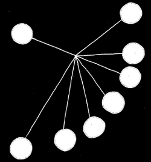
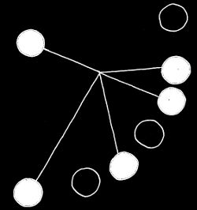
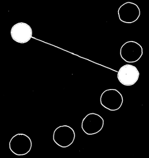

<!-- Start -->
 <!-- .slide: data-state="lnu-intro" class="center" -->

### System Administration I
### (1DV031)
# A (very) brief (and simplified) introduction to computer networks
<!-- {_style="font-size: 165%;"} -->

<!-- {_class="lnu-footer"} -->

---

<!-- CC -->
<!-- .slide: data-state="lnu-cc" -->
## Licence for this work

This work is produced by Thomas Ivarsson for the course System Administration I (1DV031) at Linnaeus University.

All content in this work excluding photographs, icons, picture of course literature and Linnaeus University logotype and symbol, is licensed under a [ Creative Commons Attribution 4.0 International License](http://creativecommons.org/licenses/by/4.0/)

#### You are free to

* copy and redistribute the material in any medium or format
* spread the whole or parts of the content
* show the whole or parts of the content publicly and digital
* convert the content to another format
* change the content

If you change the content do not use the photographs, icons, picture of the course literature or Linnaeus University logotype and symbol in your new work!

At all times you must give credit to: ”Linnaeus university – System Administration I (1DV031)” with the link https://coursepress.lnu.se/kurs/systemadministrationi/ and to the Creative Common-license above.

<!-- HERE STARTS THE ACTUAL LECTURE -->

---

## This is a three part lecture

* Who is who?
* The OSI model
* Some TCP/IP protocols

---

## Part 1: Who is who?
### in (computer) communication

* Some Latin to get us started
* Some important words (with Latin roots)
* A general communication system

--

### Some Latin to get us started

* communicato
* informatio
* caudex
* medium
* datum (datus)

-- 

### An example with humans (and a cat)

What is <em>communication</em>, <em>information</em>, <em>code</em>, <em>data</em> and  a <em>medium</em> in this picture?

<!-- {_style="font-size: 75%;"} -->

--

### Some important words (I)

* message
* source
* destination

-- 

### The same example again

What is the <em>message</em>, who is the <em>source</em> and who is  the <em>destination</em>?

<!-- {_style="font-size: 75%;"} -->

--

### Some important words (II)

* transmitter
* signal
* channel
* noise
* receiver

--

### The same example (yet) again

What is the <em>transmitter</em>, <em>channel</em>, <em>signal</em> and <em>receiver</em>? Can we identify any <em>noise</em>?

<!-- {_style="font-size: 75%;"} -->

--

### A schematic diagram of a general communication system

Source: Shannon, C. E., "A mathematical theory of communication", in <em>Mobile computing and communciations review</em>, volume 5, issue 1, 2001, page 3.

<!-- {_style="font-size: 50%;"} -->

--

### Closing note: A few modes of communication

* Unicast
* Broadcast
* Multicast
* Anycast

--

### Identify the modes

&nbsp;&nbsp;&nbsp;

<!-- {_style="margin-left: 20px;"} -->

<!-- {_style="margin-left: 165px;"} -->

---

## Part 2: The OSI model

### The open systems interconnection basic reference model ISO/IEC 7498-1:1994(E)

---

## Part 3: Some TCP/IP protocols
