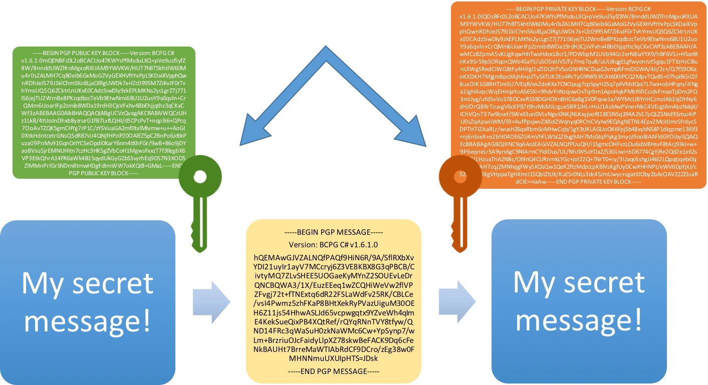
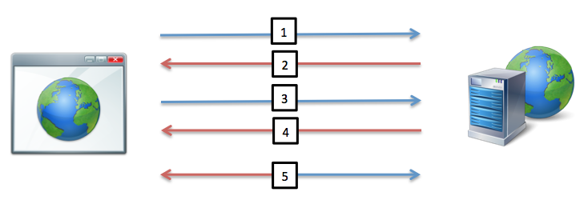
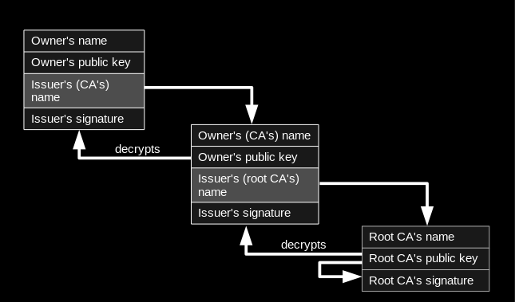
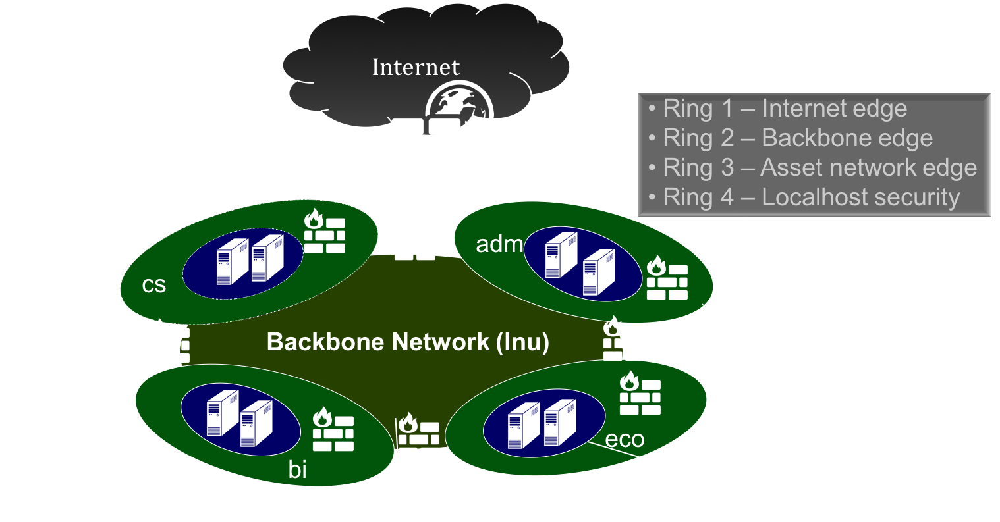

<!-- Start -->
# Today's lecture <!-- {_style="font-size:140%"} -->
* Cryptography - Basic Principles <!-- {_class="fragment"} -->
  * Some definitions
  * Asymmetric and Symmetric keys
  * Certificate
  * SSH
* Network <!-- {_class="fragment"} -->
  * Firewall
  * DMZ


Note:
These are the topics for todays lecture.


---
### Cryptography - Some definitions 

From Ancient Greek: κρυπτός, kryptós "hidden, secret"; and γράφειν graphein, "to write" <!-- {_style="font-style:italic;""} -->

* Confidentiality (Encryption) <!-- {_class="fragment"} -->
  * Keep it secret
* Authentication and Authorization <!-- {_class="fragment"} -->
  * Who are you and what you could do
* Data Integrity <!-- {_class="fragment"} -->
  * Correct data, no manipulation (or deleting) of data, not reachable for unauthorized users
* Non Repudiation <!-- {_class="fragment"} -->
  * A service that provides proof of the integrity and origin of data.
  * An authentication that can be said to be genuine with high confidence.
    * Digital signatures


Note:
Encryption
In a simplest form, encryption is to convert the data in some unreadable form. This helps in protecting the privacy while sending the data from sender to receiver.
Authentication
Suppose, Alice sends a message to Bob and now Bob wants proof that the message has been indeed sent by Alice. This can be made possible if Alice performs some action on message that Bob knows only Alice can do.
Integrity
Now, one problem that a communication system can face is the loss of integrity of messages being sent from sender to receiver. Bob wants to know that the message Alice sent hasn't been modified on the way. This can be achieved by using the concept of cryptographic hash.
Non Repudiation
What happens if Alice sends a message to Bob but denies that she has actually sent the message? Cases like these may happen and cryptography should prevent the originator or sender to act this way. One popular way to achieve this is through the use of digital signatures.


--
### Secret Key Cryptography
<!-- {_style="width:550px;"} -->


* The sender applies a key to encrypt a message 
* The receiver applies the same key to decrypt the message 
* Only single key is used - symmetric encryption 
* The biggest problem with symmetric encryption is distribution of the key


--
### Public Key Cryptography
<!-- {_style="width:600px;"} -->

* Each party has a private key and a public key <!-- {_class="fragment"} -->
* The private is secret and is not revealed while the public key is shared with all those whom you want to communicate with <!-- {_class="fragment"} -->
  * Asymmetric encryption
<!-- {_style="width:70%;"} -->


--
### Certificates
* Digitally signed documents
* Verifies the validity of the public key 
* The user's guarantee that: 
  * the public key really belongs to the sender
  * the transmitter holds the private key
* What can be done with the public key 


--
### Certificates
* What does a certificate contain?
  * Serial Number
  * Subject
  * Signature Algorithm
  * Signature
  * Issuer
  * Validity period
  * Key-Usage
  * Public Key
  * Thumbprint Algorithm
  * Thumbprint (also known as fingerprint)

Note:
Serial Number: Used to uniquely identify the certificate.
Subject: The person, or entity identified.
Signature Algorithm: The algorithm used to create the signature.
Signature: The actual signature to verify that it came from the issuer.
Issuer: The entity that verified the information and issued the certificate.
Valid-From: The date the certificate is first valid from.
Valid-To: The expiration date.
Key-Usage: Purpose of the public key (e.g. encipherment, signature, certificate signing...).
Public Key: The public key.
Thumbprint Algorithm: The algorithm used to hash the public key certificate.
Thumbprint (also known as fingerprint): The hash itself, used as an abbreviated form of the public key certificate.


--
### Certificates - Web Servers
1. Client connect on port 443, requests the server identity <!-- {_class="fragment"} -->
2. Server sends a copy of the TLS Certificate, including servers public key <!-- {_class="fragment"} -->
3. Client check against list of thrusted CA´s and that the certificate is valid. Creates a symmetric key, encrypt it with the public key from the server. <!-- {_class="fragment"} -->
4. Server decrypt the symmetric key with its own private key. Start using the symmetric key when encrypt the messages <!-- {_class="fragment"} -->
5. We have a trusted and encrypted communication <!-- {_class="fragment"} -->

<!-- {_style="font-size:70%; margin-right:25%"} -->



--
### Public-Key Infrastructure (PKI)
* Anyone can send a secret message 
  * Provided they know the public key
* How do we know a key belongs to a certain issuer? 
* One solution: PKI - Public Key Infrastructure<!-- {_class="fragment"} -->
  * Trusted root authority - Certificate Authority (CA) (VeriSign, GlobalSign)
    * Everyone must know the verification key of root authority
    * Root authority can sign certificates
  * Certificates identify others, including other authorities
  * Leads to certificate chains


[ <br />By Yanpas (Own work) [CC BY-SA 4.0](http://creativecommons.org/licenses/by-sa/4.0)](https://commons.wikimedia.org/wiki/File%3AChain_of_trust.svg)

<!-- {_style="position:fixed;right: 0px; bottom: 0px;font-size:40%; width:600px"} --> <!-- {_class="fragment"} -->


--
### Perform SSH Login Without Password
1. Create public and private keys using ssh-key-gen on localhost <!-- {_class="fragment"} -->
  ```
  ssh-keygen
  Generating public/private rsa key pair.
  Enter file in which to save the key (/home/ubuntu/.ssh/id_rsa):
  Enter passphrase (empty for no passphrase):
  Enter same passphrase again:
  Your identification has been saved in /home/ubuntu/.ssh/id_rsa.
  Your public key has been saved in /home/ubuntu/.ssh/id_rsa.pub.
  ```
2. Copy the public key to remote-host using ssh-copy-id <!-- {_class="fragment"} -->
  ```
  ssh-copy-id -i ~/.ssh/id_rsa.pub user@remot-ip
  ```
3. Login to remote-host without entering the password <!-- {_class="fragment"} -->
  ```
  ssh user@remot-ip
  or
  ssh -i ~/.ssh/id_rsa.pub user@remot-ip
  ```


---
### Start using SSH keys

https://help.github.com/en/articles/about-ssh


---
## Firewall

* Manage and control network traffic
  * Different layers 
* Defend resources
* Validate access
* Record and report on events
  * Intrusion detection 
    * Special software
* Act as an intermediary

---
## Firewall

<!-- {_style="width:900px"} -->


--
## Firewall
### Ring 1 - Internet Edge
* The first attack point
  * Being exposed to attacks from outside
* Common mistakes <!-- {_class="fragment"} -->
  * Many places the most intelligent and powerful firewall
  * Most attacks occur from inside the network
* Speed is crucial <!-- {_class="fragment"} -->
  * Usually a high performance hardware firewall


--
## Firewall
### Ring 2 - Backbone Edge
* Between the internal network and the Internet Edge
* Backbone networks are providing a common network that all network segments are connected to 
* Total volume of traffic flowing in and out through the backbone Firewall is smaller than that of the Internet edge firewall 
* Begins the real firewall work through dynamic application layer filtering of both inbound and outbound traffic

<!-- {_style="width:65%"} -->


--
## Firewall
### Ring 3 - Asset network edge
* Packet filtering is insufficient
* Not only examine all incoming traffic with profound dynamic packet filtering, but also examine the output of user/group control 
* User/group control is an absolute requirement: <!-- {_class="fragment"} -->
  * You must be able to log the user name for all outgoing
  * You must be able to log an application
  * Your organization may be held responsible for material that leaves the network

<!-- {_style="width:65%"} -->


--
## Firewall - Ring 4 - LocalHost security
* Computer-based security is the last defense.
  * UFW (default firewall in Ubuntu) - https://help.ubuntu.com/community/UFW
* No firewall can completely offset the weaknesses that exist on your computer 
  * The only thing that can prevent attacks from the local network
  * Check the inbound/outbound connections that can be made and which applications can send and receive data
* Operating systems and applications must be kept updated 
  * Servers - do one thing only
* Users and services should be run with minimal permissions

<!-- {_style="width:70%"} -->


--
## Firewall
### Smaller networks
* Simple networks does not need all rings
* Public services should be located in the DMZ segment between the Internet edge and  Asset edge 
* The simplest networks only need to place a single firewall at the Internet edge 
  * Do not forget about localhost security
    * Take passwords serious!!! Always!

<!-- {_style="width:70%"} -->


--
## Demilitarized Zone (DMZ)
* A network that is placed as a neutral zone between a corporate network and the Internet
* Prevents outside users from getting direct access to the internal corporate network 
* Includes the company's external/public resources:
  * Web servers
  * Public Name servers
  * E-mail
  * FTP
* If a DMZ is penetrated the attacker won't get access to information on the internal network

<!-- {_style="width:70%"} -->
