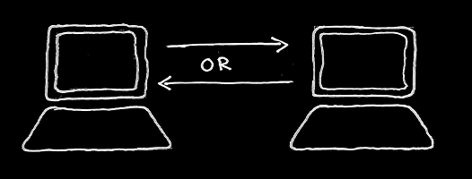

<!-- HERE STARTS THE ACTUAL LECTURE -->
## This is a three part lecture

* Who is who?
* The OSI model
* Some TCP/IP protocols


---

## Part 1: Who is who?
### in (computer) communication

* Some Latin to get us started
* Some important words (with Latin roots)
* A general communication system


--

### Some Latin to get us started

* communicato
* informatio
* caudex
* medium
* datum (datus)


--

### An example with humans (and a cat)


What is <em>communication</em>, <em>information</em>, <em>code</em>, <em>data</em> and <br />a <em>medium</em> in this picture?

<!-- {_style="font-size: 75%;"} -->


--

### Some important words (I)

* message
* source
* destination


--

### The same example again


What is the <em>message</em>, who is the <em>source</em> and who is <br />the <em>destination</em>?

<!-- {_style="font-size: 75%;"} -->


--

### Some important words (II)

* transmitter
* signal
* channel
* noise
* receiver


--

### The same example (yet) again


What is the <em>transmitter</em>, <em>channel</em>, <em>signal</em> and <em>receiver</em>?<br />Can we identify any <em>noise</em>?

<!-- {_style="font-size: 75%;"} -->


--

### A schematic diagram of a general communication system


Source: Shannon, C. E., "A mathematical theory of communication", in <em>Mobile<br />computing and communications review</em>, volume 5, issue 1, 2001, page 3.

<!-- {_style="font-size: 50%;"} -->


--

### Closing note: A few modes of communication

* Unicast
* Broadcast
* Multicast
* Anycast


--

### Identify the modes

&nbsp;&nbsp;&nbsp;

<!-- {_style="margin-left: 20px;"} -->


<!-- {_style="margin-left: 165px;"} -->


---

## Part 2: The OSI model

### The open systems interconnection<br />basic reference model<br />ISO/IEC 7498-1:1994(E)


--

### What is the OSI model?

* Conceptual 7 layer model
* Defines different aspects of computer communication
* Entities at one level communication with entities at the corresponding layer at the other end


--

### The (empty) model


--

### Vertical interaction between layers


--

### Horizontal interaction between layers


--

### Question about basic needs


What is the first thing we need<br /> for this communication to work?


--

### The answer is in the 1st layer


--

### Next we need to control the medium


--

### Some (fun) data link stuff

* CSMA/CD
* CSMA/CA
* MAC addresses
* Ethernet frames


--

### How do we solve this problem?


<!-- {_style="padding-top: 2em"} -->


--

### We add a new layer


--

### Fun stuff found in the network layer

* Routing protocols
* End-to-end encryption
* IP addresses

<!-- {_style="font-size: 80%"} -->


1. Do we use network layer stuff here?
2. Do we need network layer stuff here?

<!-- {_style="font-size: 50%"} -->


--

### The 4th layer: Transport


--

### Some features in the transport layer

* Connections oriented
* Connectionless
* Message segmentation
* Error handling
* Flow control


--

### Connection negotiation: the session layer


--

### Functions in the session layer

* Establish
* Manage
* Terminate
* Duplex


--

### Know your duplex





--

### Layer 6: the context provider


--

### The top layer: Application


--

### Nota bene!

application layer != "the application"
<!-- {_style="75%; padding-bottom: 1.5em"} -->

What is the "application layer entity"<br />
if you are surfing the Web?
<!-- {_style="padding-bottom: 1.5em"} -->


--

### Repetition: the complete model


---

## Part 3: Some TCP/IP protocols


--

### Repetition: the complete (OSI) model


--

## Our example

http://test-thison.c9users.io/hello.html

``` HTML
<html>
    <head>
        <title>Hello World!</title>
    </head>
    <body>
        <h1>Hello World!</h1>
        <p>Can it be more basic?</p>
    </body>
</html>
```

Where in to model does this fit?!


--

### Hypertext markup language

HTML is still outside the model,<br />it is not part of the network.
<!-- {_style="padding-top: 1em"} -->


<!-- {_style="padding-top: 4.5em"} -->


--

### The application layer

Now we move into the network<br />
putting the HTML code in a <br />
Hypertext transfer protocol (HTTP) message.
<!-- {_style="padding-top: 1em"} -->

```
GET /hello.html HTTP/1.1
User-Agent: Wget/1.16.1 (linux-gnu)
Accept: */*
Accept-Encoding: identity
Host: test-thison.c9users.io
Connection: Keep-Alive
```
<!-- {_style="padding-top: 2em"} class="lnu-code" -->

The HTTP header is added to the HTML code

<!-- {_style="padding-top: 1em"} -->

