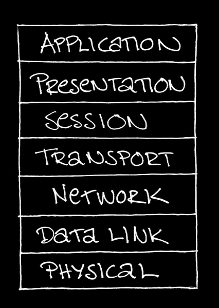

<!-- HERE STARTS THE ACTUAL LECTURE -->
## This is a three part lecture

* Who is who?
* The OSI model
* Some TCP/IP protocols


---

## Part 1: Who is who?
### in (computer) communication

* Some Latin to get us started
* Some important words (with Latin roots)
* A general communication system


--

### Some Latin to get us started

* communicato
* informatio
* caudex
* medium
* datum (datus)


--

### An example with humans (and a cat)


What is <em>communication</em>, <em>information</em>, <em>code</em>, <em>data</em> and <br />a <em>medium</em> in this picture?

<!-- {_style="font-size: 75%;"} -->


--

### Some important words (I)

* message
* source
* destination


--

### The same example again


What is the <em>message</em>, who is the <em>source</em> and who is <br />the <em>destination</em>?

<!-- {_style="font-size: 75%;"} -->


--

### Some important words (II)

* transmitter
* signal
* channel
* noise
* receiver


--

### The same example (yet) again


What is the <em>transmitter</em>, <em>channel</em>, <em>signal</em> and <em>receiver</em>?<br />Can we identify any <em>noise</em>?

<!-- {_style="font-size: 75%;"} -->


--

### A schematic diagram of a general communication system


Source: Shannon, C. E., "A mathematical theory of communication", in <em>Mobile<br />computing and communications review</em>, volume 5, issue 1, 2001, page 3.

<!-- {_style="font-size: 50%;"} -->


--

### Closing note: A few modes of communication

* Unicast
* Broadcast
* Multicast
* Anycast


--

### Identify the modes

&nbsp;&nbsp;&nbsp;

<!-- {_style="margin-left: 20px;"} -->


<!-- {_style="margin-left: 165px;"} -->


---

## Part 2: The OSI model

### The open systems interconnection<br />basic reference model<br />ISO/IEC 7498-1:1994(E)


--

### What is the OSI model?

* Conceptual 7 layer model
* Defines different aspects of computer communication
* Entities at one level communication with entities at the corresponding layer at the other end

<!-- {_style="margin-right: 30%;"} -->


--

### The (empty) model


--

### Vertical interaction between layers


--

### Horizontal interaction between layers


--

### Question about basic needs


What is the first thing we need<br /> for this communication to work?


--

### The answer is in the 1st layer


--

### Next we need to control the medium


--

### Some (fun) data link stuff

* CSMA/CD
* CSMA/CA
* MAC addresses
* Ethernet frames


--

### How do we solve this problem?


<!-- {_style="padding-top: 2em"} -->


--

### We add a new layer


--

### Fun stuff found in the network layer

* Routing protocols
* End-to-end encryption
* IP addresses

<!-- {_style="font-size: 80%"} -->


1. Do we use network layer stuff here?
2. Do we need network layer stuff here?

<!-- {_style="font-size: 50%"} -->


--

### The 4th layer: Transport


--

### Some features in the transport layer

* Connections oriented
* Connectionless
* Message segmentation
* Error handling
* Flow control


--

### Connection negotiation: the session layer


--

### Functions in the session layer

* Establish
* Manage
* Terminate
* Duplex


--

### Know your duplex


--

### Layer 6: the context provider


--

### The top layer: Application


--

### Nota bene!

application layer != "the application"
<!-- {_style="75%; padding-bottom: 1.5em"} -->

What is the "application layer entity"<br />
if you are surfing the Web?
<!-- {_style="padding-bottom: 1.5em"} -->


--

### Repetition: the complete model




---

## Part 3: Some TCP/IP protocols


--

### Repetition: the complete (OSI) model


--

## Our example

I am asking my application to fetch me<br />
http://test-thison.c9users.io/hello.html
<!-- {_style="padding-top: 2em"} -->


<!-- {_style="padding-top: 2em"} -->


--

### The application layer

Now my application uses its network skills<br />
to fullfill my request, starting with a<br />
Hypertext transfer protocol (HTTP):
<!-- {_style="padding-top: 1em"} -->

```
GET /hello.html HTTP/1.1
User-Agent: Wget/1.16.1 (linux-gnu)
Accept: */*
Accept-Encoding: identity
Host: test-thison.c9users.io
Connection: Keep-Alive
```
<!-- {_style="padding-top: 2em" class="lnu-code"} -->


--

### The transport layer

Next (but acctually before HTTP is even used) a<br />
connection is established that can now be used<br />
to send the HTTP request. The protocl used for<br />
this is the Transmission control protocol (TCP):
<!-- {_style="padding-top: 1em"} -->

```
Src Port: 44712   Seq: 1      Len: 175
Dst Port: 80      Ack: 1      Flags: ACK
```
<!-- {_style="padding-top: 2em" class="lnu-code"} -->


--

### Detour 1: Did we just skip ...???

TCP/IP does not really bother with session<br />
and presentation layers:

<!-- {_style="font-size: 75%"} -->


&#42; The network layer is usually called "Internet" in the TCP/IP model.
<!-- {_style="font-size: 55%"} -->


--

### Detour 2: The 3-way handshake

TCP supports reliable communication.<br />
To negotiate some initial parameters<br />
it uses "the 3-way handshake".

My application:

<!-- {_style="font-size: 75%; padding-top: 1em"} -->
```
Src Port: 44712	Seq: 0      Len: 0
Dst Port: 80	               Flags: SYN
```
<!-- {_class="lnu-code"} -->

The server:

<!-- {_style="font-size: 75%"} -->
```
Src Port: 80      Seq: 0      Len: 0
Dst Port: 44712   Ack: 1      Flags: SYN, ACK
```
<!-- {_class="lnu-code"} -->

My application:

<!-- {_style="font-size: 75%"} -->
```
Src Port: 44712   Seq: 1      Len: 0
Dst Port: 80      Ack: 1      Flags: ACK
```
<!-- {_class="lnu-code"} -->


--

### The internet/network layer

Here we use the Internet protocol (IP) to get<br />
the data from one network to the other:

<!-- {_style="padding-top: 1em"} -->

```
Version: 4
Time to live: 64
Protocol: TCP (6)
Src: 192.168.1.2
Dst: 192.158.30.16
```
<!-- {_class="lnu-code" style="padding-top: 2em"} -->


--

### Detour 3: Networks and hosts

* The IPv4 address has 32 bits
* Some bits specify the network address
* Some bits specify the host address
* To help us we have the network mask

<!-- {_style="font-size: 75%"} -->

<pre>
Address: 11000000.101010000.00000001.00000010 (192.168.1.2)
Netmask: 11111111.111111111.11111111.00000000 (255.255.255.0)
Network: 11000000.101010000.00000001.00000000 (192.168.1.0)
Host   : 00000000.000000000.00000000.00000010 (0.0.0.2)

Address: 11000000.100100100.00011110.00010000 (192.158.30.16)
Netmask: 11111111.111111111.11111100.00000000 (255.255.252.0)
Network: 11000000.100100100.00011100.00000000 (192.158.28.0)
Host   : 00000000.000000000.00000010.00010000 (0.0.2.16)
</pre>
<!-- {_style="padding-top: 1em; margin-left: 0px"} --->


--

### Detour 4: Special addresses (RFC 5735)

<pre>
0.0.0.0/8        # On "this" network
10.0.0.0/8       # Private A block (RFC 1918)
127.0.0.0/8      # Loopback
169.254.0.0/16   # Link local (RFC 3927)
172.16.0.0/12    # Private B block(s) (RFC 1918)
192.0.0.0/24     # Reserved
192.0.2.0/24     # For documentation and example code
192.88.99.0/24   # 6to4 relay anycast
192.168.0.0/16   # Private C block(s) (RFC 1918)
198.18.0.0/15    # For benchmark testing
198.51.100.0/24  # For documentation and example code
203.0.113.0/24   # For documentation and example code
240.0.0.0/4      # Reserved
</pre>
<!-- {_class="lnu-code" style="padding-top: 1em"} --->

Source: RFC 5735 Special Use IPv4 Addresses (January 2010)
<!-- {_style="padding-top: 3em; font-size: 55%;"} -->


--

### The data link layer

To handle the link we use Ethernet.
<!-- {_style="padding-top: 1em"} -->

```
Src: 60:6c:66:1e:cf:d5
Dst: e8:08:8b:5a:df:82
Type: IP (0x0800)
```
<!-- {_class="lnu-code" style="padding-top: 2em; padding-bottom: 1em"} -->


--

###Did you spot the gaps?

I asked for: http://test-thison.c9users.io/hello.html

So where did ...

```
/* TCP */
Src Port: 44712
Dst Port: 80
```
<!-- {_class="lnu-code"} -->

```
/* IP */
Src: 192.168.1.2
Dst: 192.158.30.16
```
<!-- {_class="lnu-code"} -->

```
/* Ethernet */
Src: 60:6c:66:1e:cf:d5
Dst: e8:08:8b:5a:df:82
```
<!-- {_class="lnu-code"} -->

... come from?


--

### DNS (the query)

```
/* DNS (query) */
Name: test-thison.c9users.io'
Type: A
Class: IN
```
<!-- {_class="lnu-code"} -->
```
/* UDP */
Src: 9711
Dst: 53
```
<!--{_class="lnu-code"}-->
```
/* IP version 4 */
Time to live: 64
Protocol: UDP (17)
Src: 192.168.1.2
Dst: 192.168.1.1
```
<!--{_class="lnu-code"}-->
```
/* Ethernet */
Src: 60:6c:66:1e:cf:d5
Dst: e8:08:8b:5a:df:82
```
<!-- {_class="lnu-code"} -->


--

### DNS (the response)

```
/* DNS (query response) */
Name: test-thison.c9users.io'
Type: A
Class: IN
Addr: 192.158.30.16
```
<!-- {_class="lnu-code"} -->
```
/* UDP */
Src: 53
Dst: 9711
```
<!--{_class="lnu-code"}-->
```
/* IP version 4 */
Time to live: 64
Protocol: UDP (17)
Src: 192.168.1.1
Dst: 192.168.1.2
```
<!--{_class="lnu-code"}-->
```
/* Ethernet */
Src: e8:08:8b:5a:df:82
Dst: 60:6c:66:1e:cf:d5
```
<!-- {_class="lnu-code"} -->


--

### ARP (request)

```
/* ARP */
Hardware type: Ethernet
Protocol type: IP
Opcode: request
Sender MAC address: 60:6c:66:1e:cf:d5
Sender IP address: 192.168.1.2
Target MAC address: 00:00:00:00:00:00
Target IP address: 192.168.1.1
```
<!--{_class="lnu-code"}-->
```
/* Ethernet */
Dst: ff:ff:ff:ff:ff:ff
Src: 60:6c:66:1e:cf:d5
Type: ARP
```
<!--{_class="lnu-code"}-->


--

### ARP (response)

```
/* ARP */
Hardware type: Ethernet
Protocol type: IP
Opcode: reply
Sender MAC address: e8:08:8b:5a:df:82
Sender IP address: 192.168.1.1
Target MAC address: 60:6c:66:1e:cf:d5
Target IP address: 192.168.1.2
```
<!--{_class="lnu-code"}-->
```
/* Ethernet */
Dst: 60:6c:66:1e:cf:d5
Src: e8:08:8b:5a:df:82
Type: ARP
```
<!--{_class="lnu-code"}-->


--

### The chain that gives the addresses

URL (user input): <pre>http://test-thison.c9users.io/hello.html</pre>

FQDN (from URL): <pre>test-thison.c9users.io</pre>

TCP port (from URL): <pre>80</pre>

IP address (from FQDN): <pre>192.158.30.16</pre>

MAC address (from IP address): <pre>e8:08:8b:5a:df:82</pre>


--

### And the response to the HTTP GET?

HTTP header:
```
HTTP/1.1 200 OK
date: Thu, 17 Mar 2016 19:40:54 GMT
server: Apache/2.4.7 (Ubuntu)
last-modified: Thu, 17 Mar 2016 19:38:25 GMT
etag: "a3-52e43c61f819b"
accept-ranges: bytes
content-length: 163
vary: Accept-Encoding
keep-alive: timeout=5, max=100
content-type: text/html
X-BACKEND: apps-proxy
```
<!--{_class="lnu-code"}-->


--

### Protocols mentioned in this lecture

* Hypertext transfer protocol (HTTP)
* Domain name system protocol (DNS)
* Transmission control protocol (TCP)
* User datagram protocol (UDP)
* Internet protocol (version 4) (IP(v4))
* Address resolution protocol (ARP)
* Ethernet

There is a wealth of protocols out there, so you should ...


--

### Request for comments (RFC)

... start reading _Request for comments_ if you like networking.

* New (and now old) protocols and ideas
* Very technical at times
* Very informative
* Some are even funny

Some suggestions: RFC 792 (great for understanding network error messages), RFC 1180 (for an introduction to TCP/IP), RFC 1812 (for a better understanding of the Internet and routing), RFC 2324 (since April Fools' is right around the corner), RFC 5321 (if you like sending and receiving email), RFC 7230 (if you really want to get to know your HTTP), and tons more ...
<!--{_style="font-size: 65%"}-->
