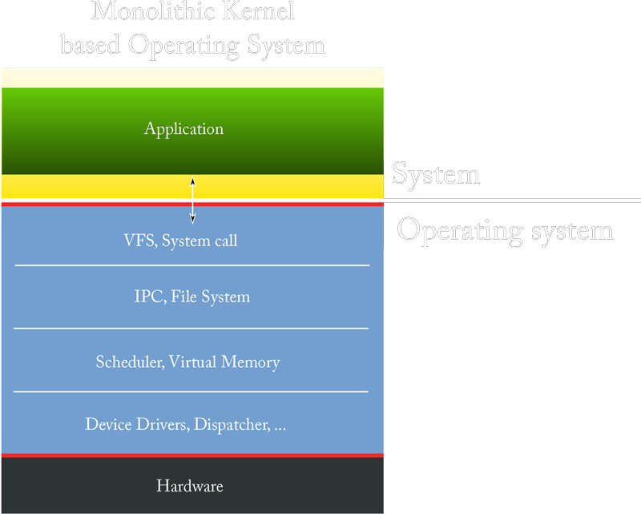
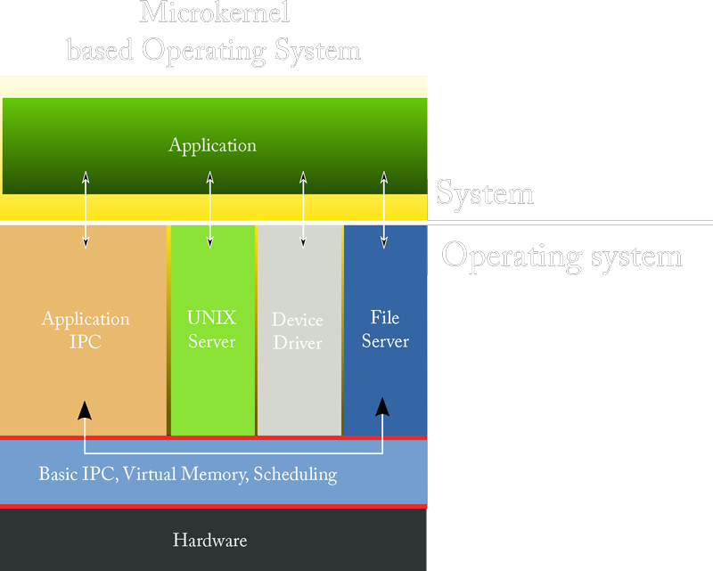
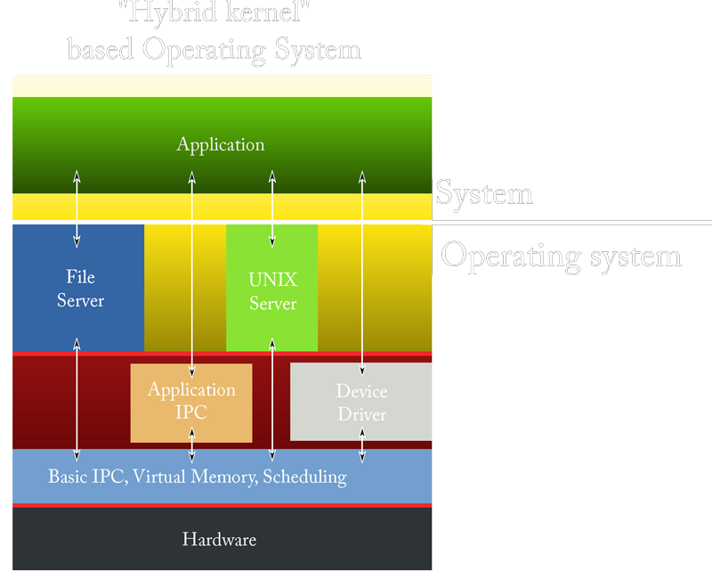
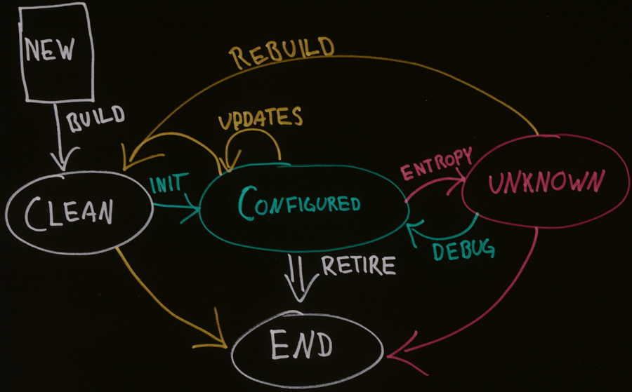

<!-- Start -->
# Interact with students
* How to get feedback from distance students?
* How to ask questions?
* Did the student understand the lecture?

http://trypingo.com
<!-- {_class="fragment"} -->

--
## Have you ever installed a server?
1. Yes
2. No

<!-- {_class="pingo-sc"} -->

 [http://pingo.upb.de/321168](http://pingo.upb.de/321168)

<!-- {_class="pingo-qr" style="top:300px"} -->

---
## Server - from hardware to software
1. Hardware
2. Operating system
3. Software

<!-- {_style="font-size:150%"} -->

Note:
These are the topics for todays lecture.
We will disuse these from a Server perspective  

---
## What is a Server?

 [http://pingo.upb.de/321168](http://pingo.upb.de/321168)

<!-- {_class="pingo-qr" style="top:450px"} -->

Note:
Which one is a Server?

--
## Basic components of a computer
* Input Unit
* Output Unit
* Storage Unit
* Central Processing Unit (CPU)
  * Arithmetic and Logic Unit (ALU)
  * Control Unit

<!-- {_style="font-size:100%"} -->

Note:
http://www.byte-notes.com/five-basic-components-computer-system

--
## What makes a computer into a server?
* 24/7
  * reliable
  * redundant
  * hot swap
* Monitoring
* Management

<!-- {_style="font-size:100%"} -->

Note:
What makes a computer into a server?

---
## Operating system
### What is an operating system?
* In the beginning:<!-- {_class="fragment"} -->
  > “Software controlling the hardware”
* Modern OS: <!-- {_class="fragment"} -->
  > “A layer between software and hardware”  

<!-- {_style="font-size:100%; width:100%"} -->

--
## Basic components of an OS
* Shell
* Process Manager
* Main-Memory Manager
* I/O Manager
* IPC Manager
* File System Manager

--
<!-- {_data-transition="fade-in fade-out"} -->
## Operating System Architecture

Note:
A monolithic kernel is an operating system architecture where the entire operating system is working in kernel space and is alone in supervisor mode. The monolithic model differs from other operating system architectures in that it alone defines a high-level virtual interface over computer hardware. A set of primitives or system calls implement all operating system services such as process management, concurrency, and memory management. Device drivers can be added to the kernel as modules.

--
## What is the big drawbacks with a Monolithic Kernel?
1. The kernel size increase
2. User code can easily get executed in the kernel
3. It is slow
4. Lack of extensibility
5. The bad maintainability

<!-- {_class="pingo-sc"} -->

 [http://pingo.upb.de/321168](http://pingo.upb.de/321168)

<!-- {_class="pingo-qr"} -->

Note:
What is the big drawbacks with a Monolithic Kernel?

--
<!-- {_data-transition="fade-in fade-out"} -->
## Operating System Architecture

--
<!-- {_data-transition="fade-in fade-out"} -->
## Operating System Architecture

--
<!-- {_data-transition="fade-in fade-out"} -->
## Operating System Architecture

* User mode
  * no ability to directly access hardware or reference memory
  * delegate to system APIs to access hardware or memory
  * crashes in user mode are always recoverable
* Kernel mode
  * unrestricted access to the underlying hardware
  * execute any CPU instruction and reference any memory address
  * crashes in kernel mode are catastrophic

<!-- {_style="font-size:70%;"} -->

--
## Server OS vs. Desktop OS
* Server OS is configured for Background Tasks
* Some desktop versions can have limitations:
  * Memory
  * CPUs
  * NICs
* Built in Services
  * DNS
  * DHCP
  * Web server
  * Catalog Server
* Monitoring

---
## Software - Services
### Difference between an Application and a Services
<!-- {_style="font-size:120%;"} -->
* Service
  * Perform a single or a few specialized operations
  * Most often accessed by other programs
  * Targets part of a larger problem domain
  * Runs in the background
* Application
  * Perform a wide range of operations
  * Accessed by humans
  * Targets a whole problem domain

--
## What software type is a Server?
1. Application
2. Service
3. Both
4. None of the above

<!-- {_class="pingo-sc"} -->

 [http://pingo.upb.de/321168](http://pingo.upb.de/321168)

<!-- {_class="pingo-qr" style="top:150px"} -->

Note:
What software type is a Server?

--
## Server software components

---
## The life cycle of a machine and its OS

Note:
Evards, lit p. 42
https://www.usenix.org/legacy/publications/library/proceedings/lisa97/full_papers/20.evard/20_html/main.html
