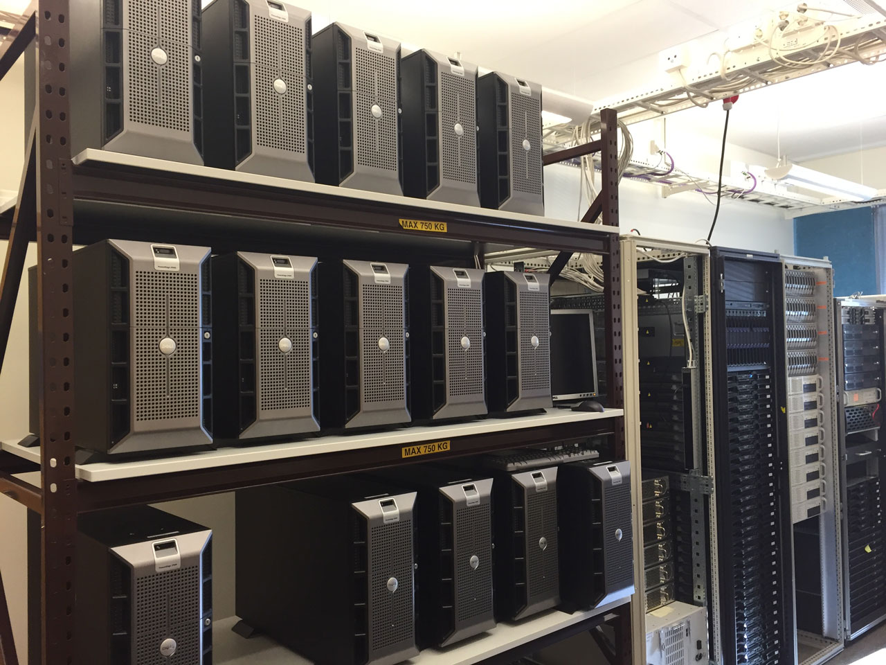

## Today's lecture
### Server - from hardware to software
* Hardware
  * CPU
  * Memory
  * IO
  * Storage
  * Network
* Operating system
  * The purpose of operating systems
  * Some background - History of operating systems
  * Different components of operating systems
  * Kernel
  * Operating System Architecture
* Software

<!-- {_style="font-size:60%"} -->

Note:
These are the topics for todays lecture  
We will disuse these from a **Server perspective** <br/ >

---
## Basic components of a computer
* Input Unit
* Storage Unit
* Central Processing Unit (CPU)
  * Arithmetic and Logic Unit (ALU)
  * Control Unit
* Output Unit

<!-- {_style="font-size:100%"} -->

Note:
Before we can understand what makes these computers into a server we must know **what makes a computer**
http://www.byte-notes.com/five-basic-components-computer-system

--
## Basic components of a computer
### Input Unit
* Accepts/reads the list of instructions/data
* Converts this to computer acceptable format
* Supplies the converted instructions and data to the computer system for further processing

<!-- {_style="font-size:100%; margin-right: 25%"} -->

Note:
1. It **accepts (or reads)** the list of instructions and data from the **outside world**.
2. It **converts** these instructions and data in computer **acceptable format**.
3. It **supplies** the converted instructions and data to the computer system **for further processing**.

--
## Basic components of a computer
### Storage Unit
*or the primary/main storage*
* Receives instructions/data from input devices
* Intermediate results of processing
* Store these results before it's released to an output device

<!-- {_style="font-size:100%; margin-right: 30%"} -->

Note:

1. All the data to be processed and the instruction required for processing (**received from input devices**).
2. **Intermediate** results of processing.
3. **Final results** of processing **before** these results are released to an **output device**.

--
## Basic components of a computer
### Central Processing Unit (CPU)
* Responsible for all events inside the computer
* Controls all internal and external devices
* 2 major components
  * Arithmetic and Logic Unit (ALU)<!-- {_class="fragment"} -->
    * Actual execution of the instructions
    * Intermediate results are temporarily transferred back to the primary storage
  * Control Unit<!-- {_class="fragment"} -->
    * How dose the input device knows that it's time to feed data into the storage unit?
    * How does the ALU know what should be done with the data once it is received?
    * Why is it only the final results that are sent to the output devices and not the intermediate results?

<!-- {_style="font-size:100%"} -->

Note:
ALU is the place where the actual execution of the instructions take place during the processing operations.

--
## Basic components of a computer
### Output Unit
* Accepts the results produced by the computer
* Converts these coded results to human acceptable (readable) form
* Supplied the converted results to the outside world

<!-- {_style="font-size:100%; margin-right: 25%"} -->

Note:
1. It **accepts** the results produced by the computer which are in **coded form** and hence cannot be easily understood by us.
2. It **converts** these coded results to human acceptable (**readable**) form.
3. It supplied the converted results to the **outside world**.

--
## What makes a computer into a server?
* 24/7 365
  * reliable
  * redundant
  * hot swap
* Monitoring
* Management

<!-- {_class="fragment"} -->

<!-- {_style="font-size:100%"} -->

Note:
What makes a computer into a server?
Show these components

--
## Blade server chassis
 <!-- {_style="width:30%"} -->
<!-- {_style="width:35%"} -->

--
## Rack server
<!-- {_style="width:30%"} -->
<!-- {_style="width:30%"} -->

--
## Server comparison
<!-- {_style="width:65%"} -->

---
## Operating system
### What is an operating system?
* In the beginning:<!-- {_class="fragment"} -->
  > “Software controlling the hardware”
* Modern OS: <!-- {_class="fragment"} -->
  > “A layer between software and hardware”  

<!-- {_style="font-size:100%; width:100%"} -->

--
## What is operating systems?
> An operating system (OS) is system software that manages computer hardware and software resources and provides common services for computer programs. All computer programs, excluding firmware, require an operating system to function.

Wikipedia, 2017 <!-- {_style="text-align: right; font-size:70%"} -->

--
## The purpose of operating systems
* To provide an environment for a computer user to execute programs on computer hardware in a convenient and efficient manner.
* To allocate the separate resources of the computer as needed to solve the problem given. The allocation process should be as fair and efficient as possible.
* As a control program it serves two major functions:
  1. supervision of the execution of user programs to prevent errors and improper use of the computer
  2. management of the operation and control of I/O devices.

--
## The purpose of operating systems
<!-- {_style="width:50%"} -->

<!-- {_style="display: inline-block;"} -->

--
## History of operating systems
Before Operating Systems if you wanted to change what the computer was doing, you had to change how the wires were connected.

Harvard Mark 1 in use, 1944 Source: [Computer History Museum](http://www.computerhistory.org/timeline/?year=1944)

<!-- {_style="font-size:50%"} -->

--
## History of operating systems
* Mainframes <!-- {_class="fragment"} -->
  * GM-NAA I/O was the first operating system, produced in 1956 by General Motors' Research division
  * [IBM 704](https://en.wikipedia.org/wiki/IBM_704)
    * [OS/360](https://en.wikipedia.org/wiki/OS/360_and_successors)
    * [DOS/360](https://en.wikipedia.org/wiki/DOS/360_and_successors)
* Minicomputers<!-- {_class="fragment"} -->
  * [DEC PDP-7](https://en.wikipedia.org/wiki/PDP-7), Digital Equipment Corporation
    * Unix operating system, AT&T Bell Laboratories in the late 1960
* Microcomputers<!-- {_class="fragment"} -->
  * Home computers 8-bit
    * BBC Micro, Commodore 64, Apple II series, Atari
  * Personal Computer
    * Interchangeable hardware, ISA, and PCI buses, increasing need for "standard" operating systems to control them
    * MS-DOS, PC DOS
    * Small boot program in ROM which loaded the OS itself from disk, BIOS or Firmware

Note: Early operating systems were very diverse, with each vendor or customer producing one or more operating systems specific to their particular mainframe computer. Every operating system, even from the same vendor, could have radically different models of commands, operating procedures, and such facilities as debugging aids. Typically, each time the manufacturer brought out a new machine, there would be a new operating system, and most applications would have to be manually adjusted, recompiled, and retested.

--
## Basic components of operating systems
* Process Manager
* Memory management
  * Registers, CPU cache, random access memory and disk storage
  * Coordinates the use of these various types
* Disk and file systems
  * ext2, ext3, FAT32, NTFS, HFS+
* Networking
  * TCP/IP networking protocols
* Security
  * Access control
  * Auditing
* Shell

Note:
1. **Process** is a **system abstraction**, it illustrates that system has only one job to do. **Every program** running on a computer, be it background services or applications, **is a process**. **Process management** involves computing and **distributing CPU time**.
2. Current computer architectures **arrange** the computer's memory in a **hierarchical manner**, starting from the fastest registers, CPU cache, random access memory and disk storage. **Memory manager coordinates** the use of these various types

--
<!-- {_data-transition="fade-out"} -->
## Components of operating systems
### Kernel
* the core of the operating system
* provides the most basic level of control over all of the computer's hardware devices, with the help of device drivers or firmware
* usually loaded into a protected area of memory
* The kernel performs its tasks, such as running processes and handling interrupts, in kernel space/mode

--
## Components of operating systems
### Modes
* User mode
  * no ability to directly access hardware or reference memory
  * delegate to system APIs to access hardware or memory
  * crashes in user mode are always recoverable
* Kernel mode
  * unrestricted access to the underlying hardware
  * execute any CPU instruction and reference any memory address
  * crashes in kernel mode are catastrophic

<!-- {_style="font-size:70%;"} -->

Note:
We will go thru these OS architectures but first we must understand User and Kernel mode.

--
<!-- {_data-transition="fade-in fade-out"} -->
## Components of operating systems
### Operating System Architecture

--
<!-- {_data-transition="fade-in fade-out"} -->
## Operating System Architecture

Note:
A monolithic kernel is an operating system architecture where the **entire operating system** is working in **kernel space** and is alone in supervisor mode. The monolithic model differs from other operating system architectures in that it alone defines a high-level virtual interface over computer hardware. A set of primitives or system calls implement all operating system services such as process management, concurrency, and memory management. **Device drivers can be added to the kernel as modules**.

--
<!-- {_data-transition="fade-in fade-out"} -->
## Operating System Architecture

Note:
Microkernel is the **near-minimum** amount of software that can provide the mechanisms needed **to implement an operating system (OS)**. These mechanisms include low-level address space management, thread management, and inter-process communication (IPC).

--
<!-- {_data-transition="fade-in fade-out"} -->
## Operating System Architecture

Note:
Hybrid kernel is a kernel architecture based on a **combination of microkernel and monolithic kernel** architecture used in computer operating systems. This kernel approach **combines** the **speed and simpler** design of monolithic kernel with the **modularity and execution safety** of microkernel.

--
## Server OS vs. Desktop OS
* Server OS is configured for Background Tasks
* Some desktop versions can have limitations:
  * Memory
  * CPUs
  * NICs
* Built in Services
  * DNS
  * DHCP
  * Web server
  * Catalog Server
* Monitoring

---
## Software - Services
### Difference between an Application and a Services
<!-- {_style="font-size:120%;"} -->
* Service <!-- {_class="fragment"} -->
  * Perform a single or a few specialized operations
  * Most often accessed by other programs
  * Targets part of a larger problem domain
  * Runs in the background
* Application <!-- {_class="fragment"} -->
  * Perform a wide range of operations
  * Accessed by humans
  * Targets a whole problem domain

--
## Server software
> A server is a program that awaits and fulfills requests  
> from client programs in the same or other computers.

<!-- {_style="font-size:100%; width:100%"} -->

* Components
  * Service/daemon running in the background
  * program to manage/monitor the service
    * Graphical user interface, GUI
    * Command-line interface, CLI

<!-- {_style="font-size:100%;"} -->

Note:
Command-line interface
