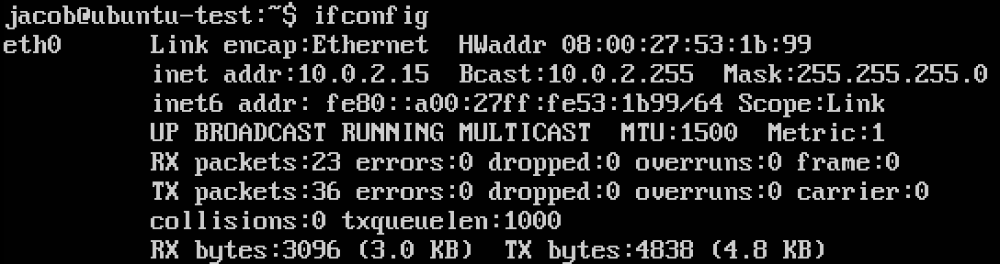
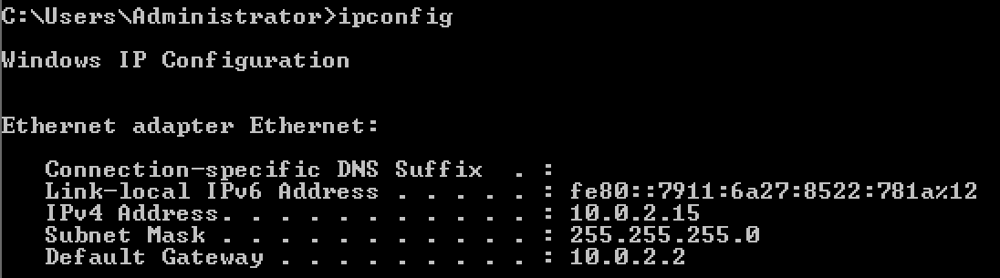
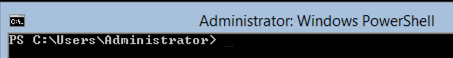

<!-- Start -->
# Interact with students
* How to get feedback from distance students?
* How to ask questions?
* Did the student understand the lecture?

http://trypingo.com
<!-- {_class="fragment"} -->


--
<!-- {_data-transition="fade-in fade-out"} -->
## Does questions make you more active during the lecture?
1. Yes
2. No

<!-- {_class="pingo-sc" style="font-size:140%"} -->


 [http://pingo.upb.de/930192](http://pingo.upb.de/930192)

<!-- {_class="pingo-qr" style="top:150px"} -->


--
<!-- {_data-transition="fade-in fade-out"} -->
## Does questions make you more active during the lecture?


<!-- {_class="pingo-chart"} -->

{Paste Handler}
<!-- {_class="chart-input" contenteditable="true" onpaste="handlepaste(this, event)"} -->


---
# Today's lecture <!-- {_style="font-size:140%"} -->
## Installation and Post Setup <!-- {_style="font-size:110%"} -->
* Server OS Installation <!-- {_class="fragment"} -->
  * Pre Installation
  * Media
    * ISO, CD, DVD
    * Images/Clone
  * Manual or Automatic
* Managing your server<!-- {_class="fragment"} -->
  * Windows vs. Linux/Unix
  * CLI or GUI
    * Bash
    * PowerShell
* Post Setup<!-- {_class="fragment"} -->
  * Network
  * Updates
  * Security

<!-- {_style="font-size: 65%"} -->

Note:
These are the topics for todays lecture.


---
## OS Installation - Pre Installation
### Things to consider
* Operating System
* Hardware
* Location

### Factors<!-- {_class="fragment" data-fragment-index="1"} -->
* Server purpose
* Compatibility
* Cost
* Knowledge

<!-- {_class="fragment" data-fragment-index="1"} -->

Note:
OS
Hardware - HCL


--
## OS Installation - Pre Installation
### How to choose an server OS
|  | Windows | Linux |
|--|---------|-------|
| Hardware requirements | High<!-- {_class="fragment" data-fragment-index="1"} --> | Low<!-- {_class="fragment" data-fragment-index="1"} --> |
| Getting Started | Easy<!-- {_class="fragment" data-fragment-index="2"} --> | Hard<!-- {_class="fragment" data-fragment-index="2"} --> |
| Stability | Medium<!-- {_class="fragment" data-fragment-index="3"} --> | High<!-- {_class="fragment" data-fragment-index="3"} --> |
| Functionality | High<!-- {_class="fragment" data-fragment-index="4"} --> | Low<!-- {_class="fragment" data-fragment-index="4"} --> |
| Security | High<!-- {_class="fragment" data-fragment-index="5"} --> | High<!-- {_class="fragment" data-fragment-index="5"} --> |
| Support | Include<!-- {_class="fragment" data-fragment-index="6"} --> | Costs<!-- {_class="fragment" data-fragment-index="6"} --> |
| TCO | $$$<!-- {_class="fragment" data-fragment-index="7"} --> | $$<!-- {_class="fragment" data-fragment-index="7"} --> |

<!-- {_style="font-size: 90%; margin: 0px"} -->


--
## OS Installation - Types
* Attended installation
* Silent installation
* Unattended installation
* Headless installation
* Automated installation
* Clean installation
* Network installation

<!-- {_style="font-size:100%"} -->

Note:
https://en.wikipedia.org/wiki/Installation_(computer_programs)#Types


--
<!-- {_data-transition="fade-in fade-out"} -->
## Which installation media have you used to install an OS?
1. CD/DVD
2. USB drive
3. ISO/IMG Image
4. Template/Clone

<!-- {_class="pingo-sc" style="font-size:140%"} -->


 [http://pingo.upb.de/930192](http://pingo.upb.de/930192)

<!-- {_class="pingo-qr" style="top:150px"} -->


--
<!-- {_data-transition="fade-in fade-out"} -->
## Which installation media have you used to install an OS?


<!-- {_class="pingo-chart"} -->

{Paste Handler}
<!-- {_class="chart-input" contenteditable="true" onpaste="handlepaste(this, event)"} -->


--
## Installation Media
* Physical Hardware
  * CD/DVD or USB Drive
* Virtualized Hardware
  * ISO
  * Template/Image

<!-- {_style="font-size:100%"} -->

Note:
Traditionally, OS had to be installed but today it is usually only one image thats being copied and then configured for the hardware


---
## Managing your Server
### Windows vs. Linux
* Linux comes in many flavors - Distributions
* GUI
  * Linux: Gnome, Unity, Cinnamon, MATE, KDE, Xfce, LXDE
* Shell, text Mode Interface or CLI
  * Windows: Command prompt (cmd.exe), Windows PowerShell
  * Linux: Bash, Korn shell, Bourne shell, ash, C shell
* Managing the server and services
  * Windows: MMC, PowerShell
  * Linux: depends on the task, usually a CLI

Note:
http://www.michaelhorowitz.com/Linux.vs.Windows.html
A shell is a command interpreter. Commands can be executable files or built-ins. Commands can be bundled together into a script which a shell program executes. How the commands are packaged and wired together, using variables, functions, and control-flow operators makes up the shell's scripting language.


--
## Managing your Server
### GUI or CLI
|   | CLI | GUI |
| - | --- | --- |
| Ease of use | ✘<!-- {_class="fragment" data-fragment-index="2"} -->|  ✔<!-- {_class="fragment" data-fragment-index="2"} -->|
| Speed | ✔<!-- {_class="fragment" data-fragment-index="3"} -->|  ✘<!-- {_class="fragment" data-fragment-index="3"} -->|
| Multitasking | ✘<!-- {_class="fragment" data-fragment-index="4"} -->|  ✔<!-- {_class="fragment" data-fragment-index="4"} -->|
| Scripting | ✔<!-- {_class="fragment" data-fragment-index="5"} -->|  ✘<!-- {_class="fragment" data-fragment-index="5"} -->|
| Remote access | ✔<!-- {_class="fragment" data-fragment-index="6"} -->|  ✘<!-- {_class="fragment" data-fragment-index="6"} -->|
| History | ✔<!-- {_class="fragment" data-fragment-index="7"} -->|  ✘<!-- {_class="fragment" data-fragment-index="7"} -->|
| Resources | ✔<!-- {_class="fragment" data-fragment-index="8"} -->|  ✘<!-- {_class="fragment" data-fragment-index="8"} -->|
||||
<!-- {_class="fragment" data-fragment-index="1" style="font-size: 90%; margin: 0px"} -->


--
## Managing your Linux Server
### Bash - Bourne-Again Shell
* Unix shell program and its associated scripting language
* Default shell of the Linux and Apple's OS X
* Powerful shell, features:
  * Command line editing
  * Command history
  * Command substitution
  * Autocompletion
  * Integer arithmetic: $((...))
  * Regexes
  * Functions
  * Arrays
  * Security (restricted shell mode)
  * Prompt customization

<!-- {_style="font-size: 60%"} -->


--
<!-- {_data-transition="fade-in fade-out"} -->
## How many built in commands does Bash have?
1. less the 40
2. 40 - 100
3. more then 100

<!-- {_class="pingo-sc" style="font-size:140%"} -->


 [http://pingo.upb.de/930192](http://pingo.upb.de/930192)

<!-- {_class="pingo-qr" style="top:50px"} -->


--
<!-- {_data-transition="fade-in fade-out"} -->
## How many built in commands does Bash have?


<!-- {_class="pingo-chart"} -->

{Paste Handler}
<!-- {_class="chart-input" contenteditable="true" onpaste="handlepaste(this, event)"} -->


--
## Managing your Linux Server - Bash
Built-in commands
```
:         command    eval      jobs      read        times
.         compgen    exec      kill      readarray   trap
[         complete   exit      let       readonly    type
alias     compopt    export    local     return      typeset
bg        continue   fc        logout    set         ulimit
bind      declare    fg        mapfile   shift       umask
break     dirs       getopts   pushd     shopt       unalias
builtin   disown     hash      popd      source      unset
caller    echo       help      pwd       suspend     wait
cd        enable     history   printf    test
```
<!-- {_style="margin-right: 35%; width: 65%;"} -->
> Remember a command is either an executable file or is built into the shell.


--
## Managing your Linux Server - Bash
### Using the commandline like a pro

| Shortcuts | Output |
| --------- | ------ |
| Ctrl+A | Cursor to beginning of line |
| Ctrl+E | Cursor end of line |
| Ctrl+K | Delete to end of line |
| Ctrl+_ | Undo |
| Up and down arrows | Previous/next command in history |
| Left and right arrows | Previous/next character on current line |
| Tab | Autocompletion |
| Ctrl+R | Search the history |
| Ctrl+L | Clear the screen |
| !! | Repeat last command |
| !___ | Repeat last command beginning with ___ |
| Ctrl+C | Interrupt currently running process |
<!-- {_style="font-size: 58%; margin: 0px"} -->


--
## Managing your Linux Server - Bash
### Good Reads
* [Bash Home Page](http://cnswww.cns.cwru.edu/~chet/bash/bashtop.html)
* [Bash Reference Manual](http://cnswww.cns.cwru.edu/~chet/bash/bashref.html) <- Start here
* [Bash FAQ](http://cnswww.cns.cwru.edu/~chet/bash/FAQ)
* [Bash Guide for Beginners](http://tldp.org/LDP/Bash-Beginners-Guide/html/index.html)
* Bash programming tutorial from developer
	* [Part 1](http://www.ibm.com/developerworks/library/l-bash/)
	* [Part 2](http://www.ibm.com/developerworks/library/l-bash2/)
	* [Part 3](http://www.ibm.com/developerworks/library/l-bash3/)
* [Bash programming introduction (from 2000)](http://en.tldp.org/HOWTO/Bash-Prog-Intro-HOWTO.html)
* [Advanced Bash Scripting Guide](http://www.tldp.org/LDP/abs/html/)
* [Collection of Bash Examples](http://www.fifi.org/doc/bash/examples/)

<!-- {_style="font-size: 65%"} -->


--
### Managing your Windows Server - PowerShell
* Windows PowerShell is… <!-- {_class="fragment"} -->
  * …a command prompt.
  * …a scripting language.
  * … a combination of several components (cmdlets, pronounced command-lets) between the objects (not text!) can be sent ("Piped").
* You have… <!-- {_class="fragment"} -->
  * …full access to the Microsoft .NET Framework.
  * …an environment where you can perform administrative tasks by executing cmdlets.
  * …an environment where you can execute scripts that contain cmdlets and the code that processes the data of various kinds.
* You can… <!-- {_class="fragment"} -->
  * …for example. work with objects, variables, files, directories, registry, AD and databases.

<!-- {_style="width: 70%"} -->


--
<!-- {_data-transition="fade-in fade-out"} -->
## How many built in commands does Powershell have?
1. less the 40
2. 40 - 100
3. more then 100

<!-- {_class="pingo-sc" style="font-size:140%"} -->


 [http://pingo.upb.de/930192](http://pingo.upb.de/930192)

<!-- {_class="pingo-qr" style="top:50px"} -->


--
<!-- {_data-transition="fade-in fade-out"} -->
## How many built in commands does Powershell have?


<!-- {_class="pingo-chart"} -->

{Paste Handler}
<!-- {_class="chart-input" contenteditable="true" onpaste="handlepaste(this, event)"} -->


--
### Managing your Windows Server - PowerShell

| Shortcuts | Output |
| --------- | ------ |
| ` | insert a line break or as an escape character |
| Alt+Space+E | Displays an editing shortcut menu with Mark, Copy, Paste, Select All, Scroll, and Find options |
| Alt+F7 | Clears the command history. |
| Ctrl+C | break out of the subprompt or terminate execution. |
| Ctrl+End | delete all the characters in the line after the cursor. |
| Ctrl+Left/Ctrl+Right arrow | Move left or right one word at a time. |
| Ctrl+S | Pause or resume the display of output. |
| Esc | Clear the current line. |
| Home/End | Move to the beginning or end of the line. |
| Page Up/Page Down | Access the first or last command in the command history. |
| Tab/Shift+Tab | Access the tab expansion function. |
| Up/Down arrow | Scan forward or backward through your command history. |
<!-- {_style="font-size: 58%; margin: 0px; width: 70%"} -->


--
## Managing your Server - PowerShell
### Good Reads
* [Scripting with Windows PowerShell](https://technet.microsoft.com/en-us/library/bb978526.aspx)
* [A Task-Based Guide to Windows PowerShell Cmdlets](http://technet.microsoft.com/en-us/scriptcenter/dd772285.aspx)
* [Configure a Server Core Server](https://technet.microsoft.com/en-us/library/jj592692.aspx)
* [Windows PowerShell Blog](http://blogs.msdn.com/b/powershell/)
* [Desired state configuration](http://blogs.technet.com/b/privatecloud/archive/2013/08/30/introducing-powershell-desired-state-configuration-dsc.aspx)

### Video
* [Getting Started with PowerShell 3.0 Jump Start](https://mva.microsoft.com/en-us/training-courses/getting-started-with-powershell-3-0-jump-start-8276?l=r54IrOWy_2304984382)
* [Advanced PowerShell Desired State Configuration (DSC) and Custom Resources](https://mva.microsoft.com/en-US/training-courses/advanced-powershell-desired-state-configuration-dsc-and-custom-resources-8702?l=3DnsS2H1_1504984382)


--
### Managing your Server
| PS Cmdlet |  PS Alias | Unix shell | Description |
| --------------------| ------------------ | ---------- | ----------- |
| Get-ChildItem | gci, dir, ls | ls | List all files |
| Test-Connection | N/A | ping | Sends ICMP echo requests to a machine |
| Get-Content | gc, type, cat | cat | Get the content of a file |
| Get-Command | gcm | type, which | List available commands |
| Get-Help | help, man | apropos, man | Help on commands |
| Copy-Item | cpi, copy, cp | cp | Copy files/a whole directory tree |
| Move-Item | move, mv | mv | Move a file/a directory to a new location |
| Remove-Item | rmdir, rm | rm, rmdir | Delete a file / a directory |
| Rename-Item | rni, ren, mv | mv | Rename a file / a directory |
| Get-Location | gl, cd, pwd | pwd | Display the current directory |
| Set-Location | sl, cd, chdir | cd | Change the current directory |
| Write-Output | echo, write | echo | Print strings, variables etc. |
| Get-Process | gps, ps | ps | List all currently running processes |
| Stop-Process | spps, kill | kill[e] | Stop a running process |
| Select-String | sls | grep | Print lines matching a pattern |
| Set-Variable | sv, set | env, export, set | Set the value of a variable |
| Invoke-WebRequest | iwr, curl, wget | wget, cURL | Gets content from a web page on the Internet |
<!-- {_style="font-size: 48%; margin: 0px; width: 70%"} -->


--
<!-- {_data-transition="fade-in fade-out"} -->
## What do you prefer, GUI or CLI?
1. GUI
2. CLI

<!-- {_class="pingo-sc" style="font-size:140%"} -->


 [http://pingo.upb.de/930192](http://pingo.upb.de/930192)

<!-- {_class="pingo-qr" style="top:240px"} -->


--
<!-- {_data-transition="fade-in fade-out"} -->
## What do you prefer, GUI or CLI?


<!-- {_class="pingo-chart"} -->

{Paste Handler}
<!-- {_class="chart-input" contenteditable="true" onpaste="handlepaste(this, event)"} -->


---
## Post Setup
* Install drivers, Chip-set
* Computer name
* Configure network
* Updates
* Security


--
## Post Setup - Computer name
* Ubuntu
```bash
sudo nano /etc/hostname
sudo nano /etc/host
sudo reboot
```
* Windows
```
Rename-Computer -NewName new-server-name -restart
```

<!-- {_style="width: 50%"} -->


--
## Post Setup - Display Network
* Linux

<!-- {_style="width: 50%"} -->
* Windows

<!-- {_style="width: 60%"} -->


--
## Post Setup - Configure Network
* Windows
  * Get interface name
  ```
  netsh interface ip show config
  ```
  <!-- {_style="margin: 0px"} -->
  * Set Static IP
  ```
  netsh interface ip set address "Ethernet" static 192.168.0.101
  255.255.255.0 192.168.0.1
  ```
  <!-- {_style="margin: 0px"} -->
  * Set Static DNS
  ```
  netsh interface ip add dns "Ethernet" 8.8.8.8 index=1
  ```
  <!-- {_style="margin: 0px"} -->
  * Set IP to DHCP
  ```
  netsh interface ip set address "Ethernet" dhcp
  ```
  <!-- {_style="margin: 0px"} -->
  * Set DNS DHCP
  ```
  netsh interface ip set dns "Ethernet" dhcp
  ```
  <!-- {_style="margin: 0px"} -->

<!-- {_style="width: 70%"} -->


--
## Post Setup - Configure Network
* Ubuntu
  * Show current configuration
  ```bash
  #IP Settings
  ifconfig
  #DNS Settings
  cat /etc/resolv.conf
  ```
  <!-- {_style="margin: 0px"} -->
  * Set Static IP and DNS - edit **/etc/network/interfaces**
  ```bash
    auto eth0
      iface eth0 inet static
        address 192.168.0.101
        netmask 255.255.255.0
        gateway 192.168.0.101
        dns-nameservers 8.8.8.8 8.8.4.4
  ```
  <!-- {_style="margin: 0px"} -->
  * Set IP and DNS to DHCP
  ```bash
    auto eth0
      iface eth0 inet dhcp
  ```
  <!-- {_style="margin: 0px"} -->
  * Activating settings
  ```bash
  sudo ifdown eth0 && sudo ifup eth0
  ```
  <!-- {_style="margin: 0px"} -->


<!-- {_style="width: 70%"} -->


--
## Post Setup - Updates
* Ubuntu
```bash
sudo apt-get update
sudo apt-get upgrade
```
* Windows
```
sconfig
```

<!-- {_style="width: 50%"} -->


--
## Post Setup - Security
Where is root?
* root is disable in Ubuntu
* Use `sudo` to carry out system administrative duties
* Enable the root account [Not recommended]:
  * If for some reason you wish to enable the root account, simply give it a password:
  ```bash
  sudo passwd
  ```
  <!-- {_style="margin: 0px;"} -->
  * Sudo will prompt you for your password, and then ask you to supply a new password for root:
  ```bash
  [sudo] password for username: #(enter your own password)
  Enter new UNIX password: #(enter a new password for root)
  Retype new UNIX password: #(repeat new password for root)
  passwd: password updated successfully
  ```
  <!-- {_style="margin: 0px;"} -->
  * To disable the root account, use the following passwd syntax:
  ```bash
  sudo passwd -l root
  ```
  <!-- {_style="margin: 0px;"} -->
  * You should read more on Sudo by checking out it's man page:
  ```bash
  man sudo
  ```
  <!-- {_style="margin: 0px;"} -->

<!-- {_style="width: 60%; font-size:70%"} -->

Note:
By default, the initial user created by the Ubuntu installer is a member of the group "admin" which is added to the file /etc/sudoers as an authorized sudo user. If you wish to give any other account full root access through sudo, simply add them to the admin group.


--
## Post Setup - Security

* User Account Control (UAC)
* User need to be elevated to carry out system administrative duties
* Not available in command prompt/powershell/server core



--
## Post Setup - Security
* Ubuntu ufw - Uncomplicated Firewall
  * Easy config for iptables
  * Not active by default

```bash
sudo ufw enable
sudo ufw allow 22
sudo ufw status
```
<!-- {_style="margin-left: 50px; width: 60%"} -->
* Windows Firewall with Advanced Security
  * 3 in 1 - Public, Private and Domain

```
netsh advfirewall firewall add rule name="All ICMP V4"
dir=in action=allow protocol=icmpv4
```
<!-- {_style="margin-left: 50px; width: 60%"} -->


---
## Summary - Take ways
* Important decisions before installation
* Big management differences between Windows and Linux
* Choose CLI over GUI
* Check the firewall after installation

> “Do not be afraid of the CLI, learn to harness its powers”

<!-- {_style="margin-left: 50px; width: 60%" class="fragment"} -->
