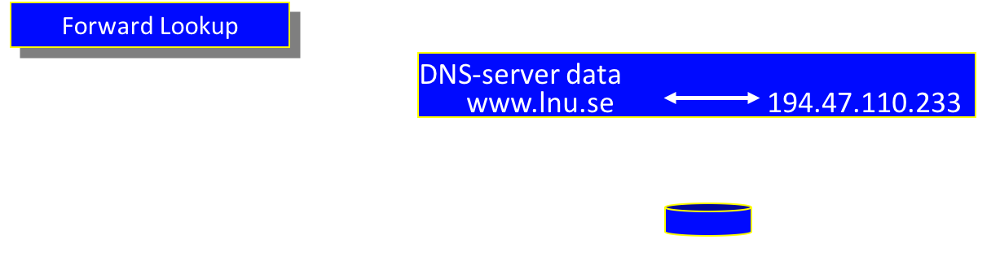
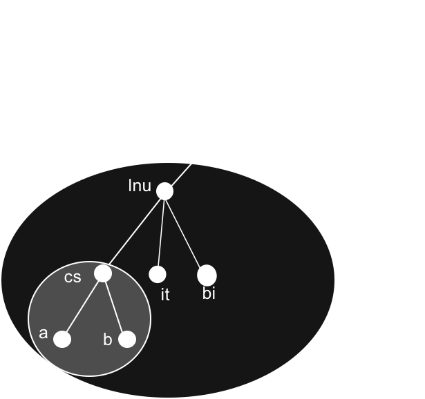
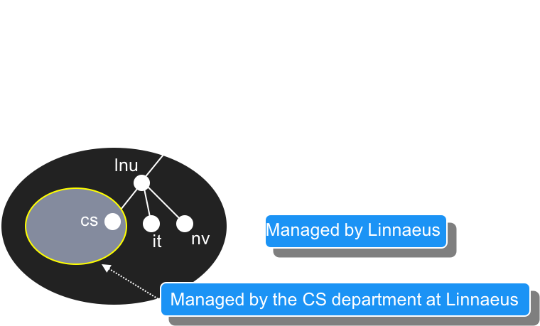
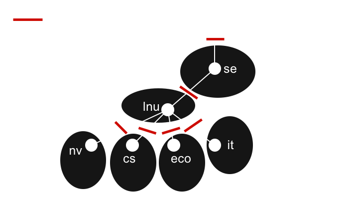
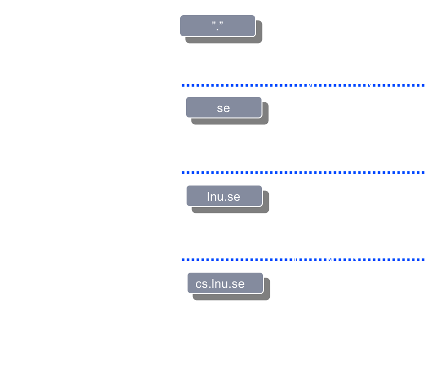

<!-- Start -->
#### Content
* DNS
  * What is DNS?
  * Terminology
  * Hierarchy
  * Delegation
  * Zones
  * Caching

<!-- {_style="font-size: 70%"} -->

Note:
These are the topics for todays lecture.


---
#### DNS - Domain Name System
* IP to domain names and vice versa
  * Client/Server
    * DNS query
    * Name servers


<!-- {_style="width: 70%" class="fragment"} -->


--
#### DNS Structure & Terminology
* root
* FQDN - Fully Qualified Domain Name
  * Absolute domain name for a computer or host on Internet
  * a.cs.lnu.se
  * www.lnu.se
* TLD - top-level domains
  * .se
* Domain
  * lnu.se
* Sub domain
  * cs
* Host
  * a



<!-- {_style="width: 40%; position: absolute; top: 240px; left: 500px;"} -->


--
#### DNS - Root Name Servers
* There are 13 root name server
* http://root-servers.org
  * http://letter.root-servers.org/, where letter ranges from a to m
* Internet Corporation for Assigned Names and Numbers, ICANN
  * nonprofit organization
  * responsible for coordinating the namespaces of the Internet
    * generic top-level domains (gTLDs)
    * country-code top-level domains (ccTLDs)
    * the operation of root name servers


--
#### DNS - top-level domains
* The original top-level domains:
  * com
  * edu
  * gov
  * mil
  * net
  * org
  * int
* As of April 2018
  * 1534 top-level domains

Note:
De ursprungliga toppdomänerna:
från början var Internetnamnområdet indelat i nedanstående sju olika namnområden.
com kommersiella organisationer, så som Hewlett-Packard (hp.com), Sun Microsystem (sun.com) och IBM (ibm.com).
edu utbildningsorganisationer, såsom U.C Berkeley (berkeley.edu).
gov regeringsorganisationer, såsom NASA (nasa.gov) och National Science Foundation (nsf.gov).
mil militära organisationer, såsom U.S. Army (army.mil) och U.S. Navy (navy.mil).
net organisationer som tillhandhåller nätverksinfrastrukturen, såsom NSFNET (nsf.net) och UUNET (uu.net). Men sedan 1996 har net varit öppet för alla kommersiella organisationer.
org icke kommersiella organisationer, såsom Electronic Frontier Foundation (eff.org), men som för net-namnområdet har restriktioner tagits bort.
int internationella icke kommersiella organisationer, såsom NATO (nato.int).


--
#### DNS - Delegation
* One of the goals in the design of the DNS was to decentralize the administration:
* Parent domain contains only a pointer



<!-- {_style="float: left; width: 50%"} -->


--
#### DNS - Zones
* Contains all domain names in the domain, except for domain names in delegated subdomains
* Name servers loads the zone is not the domain


Note:
Zoner:
 innehåller alla domännamn i domänen med samma namn, förutom domännamn i delegerade subdomäner
 namnservrar laddar in zoner istället för domäner eftersom en domän kan innehålla mer information än vad namnservern behöver. En domän kan innehålla data som har blivit delegerade till en annan namnserver
 eftersom zoner är sammanbundna genom delegering kommer en zon aldrig innehålla delegerad data
 skulle en rotnamnserver ladda in en domän istället för en zon, skulle den ladda hela namnområdet


--
#### DNS - Name server and zones
* Name server = "Server application" that store information about the zone
  * Loaded from a file or another name server, like a database in memory
* Responsibility for the zone
* May be responsible for multiple zones

Note:
Namnservrar och zoner:
 program som sparar information om domännamnområdet kallas namnservrar
 namnservrar har generellt all information av en del av domännamnområdet, detta området kallas en zon
 informationen laddas in från en fil eller en annan namnserver
 namnservern sägs ha ansvar (authority) för zonen den har information om. En namnserver kan vara ansvarig för flera zoner.


--
#### DNS -  Name server
Types of name servers:
* Primary Master
  * The primary name server loads zone data from the zone file
  * Read and Write access to the zone file
* Secondary Master <!-- {_class="fragment"} -->
  * Read only
  * The secondary name server loads zone data from the primary name server or another secondary name server
  * When the secondary name server starts up, contact the their "master" server, and if necessary, it downloads zone data, this is called "zone transfer".

<!-- {_style="width: 65%"} -->


--
#### DNS - Finding the root server
How can your Name Server find the root server?
* Forwarders
* Root Hints file
  * in standard installation of your DNS server software

```
; formerly NS.INTERNIC.NET
.                        3600000      NS    A.ROOT-SERVERS.NET.
A.ROOT-SERVERS.NET.      3600000      A     198.41.0.4
A.ROOT-SERVERS.NET.      3600000      AAAA  2001:503:ba3e::2:30
;
; FORMERLY NS1.ISI.EDU
.                        3600000      NS    B.ROOT-SERVERS.NET.
B.ROOT-SERVERS.NET.      3600000      A     192.228.79.201
B.ROOT-SERVERS.NET.      3600000      AAAA  2001:500:84::b
;
; FORMERLY C.PSI.NET
.                        3600000      NS    C.ROOT-SERVERS.NET.
C.ROOT-SERVERS.NET.      3600000      A     192.33.4.12
C.ROOT-SERVERS.NET.      3600000      AAAA  2001:500:2::c
;
; FORMERLY TERP.UMD.EDU
.                        3600000      NS    D.ROOT-SERVERS.NET.
D.ROOT-SERVERS.NET.      3600000      A     199.7.91.13
D.ROOT-SERVERS.NET.      3600000      AAAA  2001:500:2d::d
```
<!-- {_style="font-size: 33%; margin: 0px; width:50%"} -->


--
#### DNS - Caching
* Performance
* Time To Live:  <!-- {_class="fragment"} -->
  * Max time
  * Long TTL <!-- {_class="fragment"} -->
    * Pros
    * Cons
  * Short TTL <!-- {_class="fragment"} -->
    * Pros
    * Cons

<!-- {_style="font-size: 100%"} -->

Note:
Caching:
Det kan tyckas att översättningsprocessen är invecklad och därför borde vara långsam men så är inte fallet utan den är vanligtvis relativt snabb. Något som ökar sökprestandan ännu mer är caching.
När en namnserver utför rekursiva frågor kan den vara tvungen att sända ett antal frågor för att hitta ett svar. Under sökprocessen hittar namnservern mängder med information om namnområdet. Varje gång namnservern refereras till en lista med namnservar lär sig servern att de servrarna är ansvariga för någon zon samt adresserna till namnservrarna. Information som namnserven lär sig sparas i cachen för att det i framtida sökningar ska gå snabbare att hitta informationen.
Det finns även negativ caching implementerat i Microsoft DNS-server. Om en ansvarig namnserver svarar på en fråga med ett svar som säger att domännamnet eller datatypen i frågan inte existerar kommer den lokala namnservern att temporärt lagra den informationen i cachen.
Namnservern cachar data för att snabba upp exekverings tiden på frågor. Om informationen finns i cachen så svarar namnservern direkt, och om namnservern bara känner till den ansvariga namnservern för zonen så skickas en fråga direkt till den ansvariga namnservern istället för att först skicka en fråga till en rotserver vilket snabbar upp förfrågan.
Time To Live:
Eftersom den struktur som DNS-hierarkin beskriver är dynamisk, d.v.s. den ändrar sig kontinuerligt, så är det inte lämpligt att lagra information i cachen i all evighet eftersom informationen som ligger i cachen då kommer att ge en missvisande bild av DNS-hierarkin
För att inte informationen i cachen ska bli för gammal så sätts en maxtid för hur länge informationen får ligga i cachen, denna tiden är känd som Time To Live (TTL)
När TTL-tiden har gått ut måste namnservern radera informationen från cachen och hämta ny data från den ansvariga namnservern. Detta gäller även negativ cachad data.
Att bestämma TTL-värdet för din data är viktigt när det gäller förlikningen mellan prestanda och korrekthet:
Ett mindre TTL-värde kommer hjälpa till att försäkra att data i zonen är korrekt i hela nätverket, eftersom namnservern då kommer att behöva fråga fjärran namnservrar oftare p.g.a. att TTL-tiden löper ut oftare
Det negativa med att TTL-värdet sänks är att belastningen på namnservrarna ökar och medeltiden för en sökprocess i din zon ökar
Ett stort TTL-värde kommer att minska medeltiden för en sökprocess i din zon eftersom data lagras längre i cachen, nackdelen är att data i din zon kommer att bli icke korrekt under en längre period om du utför ändringar på data på din namnserver


--
#### DNS - Client
* Resolver:
  * Client side of the DNS
  * Translates name questions from program to DNS queries
  * Built-in to the operating system
    * For instance used by web browser, ping program...
    * APIs in most programming platforms...
* Tools
  * nslookup (cli)

Note:
Resolver:
 är klientdelen av Domain Name System (DNS)
 är ansvarig för att översätta namnfrågor från program till en DNS-fråga till en namnserver och för att översätta svaret från namnservern till ett svar till programmet
 alla operativsystem har sin egen ”resolver”. Konfigurationen och deras uppförande är lite olika


--
#### DNS - Query Types
* Recursive Queries
  * DNS client requires that the DNS server respond with either:
    * Requested resource record
    * Error message stating that the record or domain name does not exist
  * Generally made by a DNS client to a DNS server
    * or by a DNS server configured to use a forwarder
* Iterative Queries <!-- {_class="fragment"} -->
  * DNS client allows the DNS server to return the best answer it can give based on its cache or zone data
  * If the queried DNS server does not have an exact match
    * the best possible information it can return is a referral
    * DNS client can then query the DNS server for which it obtained a referral
    * This process is sometimes referred to as "walking the tree"
  * Typically initiated by a DNS server that attempts to resolve a recursive name query for a DNS client

<!-- {_style="width: 65%"} -->


--
#### DNS - Querys Types
Example


<!-- {_style="width: 45%"} -->


--
#### DNS - Use cases
* Public
  * Set up the Name Server
    * configure the zone for the domain
    * create a secondary name server
  * Buy the domain name from a register
    * Point the delegation to your Name servers
* Internal/Private <!-- {_class="fragment"} -->
  * you can use any TLD but not recommended
  * use a subdomain under your public domain name
    * Delegate the control to your internal Name servers
  * Create records for internal devices


--
#### DNS Zone files - example Bind

* Not a standard

```
$TTL 2d ; zone default, cached locally
example.org.    IN      SOA      ns1.example.org. admin.example.org. (
                        2006051501      ; Serial (must update when change)
                        10800           ; Refresh (Seconds between update requests slave name servers. )
                        3600            ; Retry (seconds slave will wait before retrying when the last attempt has failed)
                        4d              ; Expire (slave will wait before considering the data stale if it cannot reach the primary name server)
                        3m              ; Negative Response TTL (How long to save failing question)
                )

; DNS Servers
                IN      NS      ns1.example.org.
                IN      NS      ns2.example.org.
; MX Records
                IN      MX 10   mx.example.org.
                IN      MX 20   mail.example.org.
                IN      A       192.168.1.1
; Machine Names
ns1             IN      A       192.168.1.2
ns2             IN      A       192.168.1.3
mail            IN      A       192.168.1.5
dev             IN      A       192.168.1.7  

; Aliases
www             IN      CNAME   example.org.
```
<!-- {_style="font-size: 33%; margin: 10px; width:95%"} -->


--
#### DNS - Lookup Zones
* Forward lookup zones
 * Domain names to IP addresses
 * Resource Record Types
   * SOA(Start of Authority)
   * A or AAAA (Host)
   * CNAME(Alias)
   * NS (Name Server)
   * MX (Mail Exchanger)
   * TXT (Text record)
* Reverse lookup zones <!-- {_class="fragment"} -->
 * IP addresses to domain names
 * Resource Record Types
   * PTR (Pointer)


--
#### DNS - Resource Record Types
* SOA
  * Start of Authority
  * The name server has the best information on DNS zone
  * Make sure the server is responsible (authoritative) for the DNS zone
  * An SOA record is required in all DNS zones
  * Only one SOA record per DNS zone
  * Includes
    * Primary name server
    * Email of the domain administrator
    * Domain serial number
    * Several timers relating to refreshing the zone.


--
#### DNS - Resource Record Types
* A or AAAA record
  * Address record
  * Identifies the IP address from a hostname
  * www.lnu.se. -> 194.47.110.233
* CNAME <!-- {_class="fragment"} -->
  * Canonical name record
  * A host name is the alias for a different hostname
  * www.lnu.se. -> lnu.se.
* Name Server (NS) record  <!-- {_class="fragment"} -->
  * Identifies the Name server for a zone
  * cs.lnu.se.-> ns1.cs.lnu.se.
  * lnu.se -> ando.lnu.se.


--
#### DNS - Resource Record Types
* MX record
  * Mail Exchanger
  * Identifies which server is the mail server for a domain
  * lnu.se -> 10 e-mailfilter03.sunet.se.
* PTR record <!-- {_class="fragment"} -->
  * Pointer
  * Translating IP to domain name
  * 194.47.172.11 -> challenger1.lnu.se.
* TXT record <!-- {_class="fragment"} -->
  * Text record
  * Originally for arbitrary human-readable text
  * lnu.se -> "v=spf1 +mx +exists:%{ir}.%{v}.%{l}.at.%{o}.spf.lnu.se -ip4:124.248.222.0/24 ?all"


--
#### Configure your name server

```
$TTL 2d ; zone default, cached locally
example.org.    IN      SOA      ns1.example.org. admin.example.org. (
                        2006051501      ; Serial (must update when change)
                        10800           ; Refresh (Seconds between update requests slave name servers. )
                        3600            ; Retry (seconds slave will wait before retrying when the last attempt has failed)
                        4d              ; Expire (slave will wait before considering the data stale if it cannot reach the primary name server)
                        3m              ; Negative Response TTL (How long to save failing question)
                )

; DNS Servers
                IN      NS      ns1.example.org.
                IN      NS      ns2.example.org.
; MX Records
                IN      MX 10   mx.example.org.
                IN      MX 20   mail.example.org.
                IN      A       192.168.1.1
; Machine Names
ns1             IN      A       192.168.1.2
ns2             IN      A       192.168.1.3
mail            IN      A       192.168.1.5
dev             IN      A       192.168.1.7  

; Aliases
www             IN      CNAME   example.org.
```
<!-- {_style="font-size: 33%; margin: 10px; width:95%"} -->

