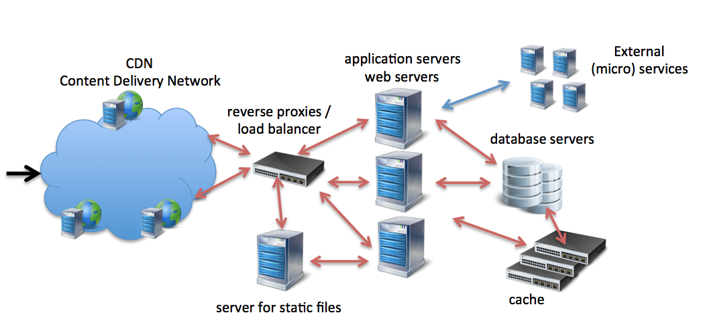

<!-- Start -->
# Today's lecture <!-- {_style="font-size:140%"} -->
* Web Servers
  * What? How? Diffrent kinds?
* HTTP
  * What? How

Note:
These are the topics for todays lecture.

---
## Web Servers

* Server software that understands HTTP/HTTPS
* Serve static web resources
  * Reading from file system
  * Documents, static files, streaming media
* Serve dynamic web resources
  * Support server-script languages like PHP, C# (ASP.NET)...
  * Render web data on-the-fly (HTML, JSON...)
  * Communicate with databases
  * Send request to other servers
* Virtual hosting (multiple domain names)
* HTTP vs. HTTPS

--
## Web Servers

* Apache
  * The A in LAMP
* IIS for Windows server (Internet Information Services)
  * .NET
* Nginx
  * Often also used as load balancer and reverse proxy (in front of web application)
* Apache Tomcat
  * JAVA, Diffrent components for servlet, HTTP, JSP engine
* Node.js
  * A plattform! Create a web server with http module!

--
## About Apache
* The most used web server on the Internet
  * http://w3techs.com/technologies/overview/web_server/all
* Open-source HTTP server for both UNIX and Windows
  * [Apache Software Foundation](Apache Software Foundation)
* The Apache HTTP Server ("httpd") was launched in 1995
  * "A-patchy-server"
* Every request is spawn to a own thread (like a own process)
  * Thread pool

--
## About Nginx ("engine x")
* Free web server, 2002, Igor Sysoev, second most used (?)
  * http://w3techs.com/technologies/overview/web_server/all
  * Also used as (reversed) proxy, load balancer, ...
* Nginx uses an asynchronous event-driven approach to handling requests
  * Non-blocking mode in a single main thread
  * Event-loop receiving event from a queue (like javascript event-loop)
  * Can handle more request, handle high loads
  * Don´t perform well on time consuming operations that blocks the tread
[Event loop](https://assets.wp.nginx.com/wp-content/uploads/2015/06/NGINX-Event-Loop2-e1434744201287.png)

--
## About IIS
* Microsoft, tight coupled to Windows
* Using modules and extensions
* Graphic Administration (tight connection to the operating system)
* .NET applications

---
## Not just web servers!

--

CC Image: https://www.flickr.com/photos/arselectronica

--
### Tim Berners-Lee

Paul Clarke [CC BY-SA 4.0 (http://creativecommons.org/licenses/by-sa/4.0)], via Wikimedia Commons

--
# TCP/IP
The web is an application running on the Internet  
HTTP is an application protocol running on the TCP/IP stack

--
## HTTP
* HTTP 0.9 (1991)
* HTTP 1.0 (1996)
* HTTP 1.1 (1997)
* HTTP 2 (May 2015)

--
### HTTP Methods (verbs)
*From Client to Server*

| *Verbs*        | *Actions*           |
| ------------- |-------------|
|GET | Get data; search result |
|POST | Create data |
|PUT | Update data |
|PATCH | Partial update of resource |
|DELETE | Delete a resource |
|HEAD | Just get headers |
|OPTIONS | Check what the server can do |

--
## Status codes - Server to client
* 1xx - Informational
 * 101 Switching Protocols
* 2xx - Successful
 * 200 OK, 201 Created, 204 No Content
* 3xx - Redirection
 * 302 Found (follow "Location"), 304 Not Modified
* 4xx - Client Error
 * 400 Bad request, 401 Unauthorized
* 5xx - Server Error
 * 500 Internal Server Error

--
## Requests and TCP connections

* Keep-Alive, Pipeline (HTTP 1.1)

--
## HTTP is old but it works great!!?

--
## So why do we need HTTP/2?
More bandwidth will speed things up!     

--
## Latency!

--
### HTTP/2
* Based on SPDY (Google)
* Internet Engineering Task Force (IETF)
* Supported by most browsers and servers
* May 14, 2015, Proposed standard [RFC 7540](https://tools.ietf.org/html/rfc7540)

--
### So whats new in HTTP/2?
* Multiplexing - one single TCP connection for many request
* Server push (not as in Web Sockets)
* Data Compression of HTTP Headers
* Binary data streams
* Priority flags

Ilya Grigorik - https://www.youtube.com/watch?v=yURLTwZ3ehk
