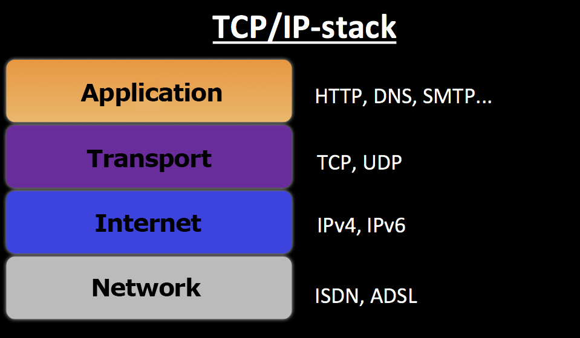
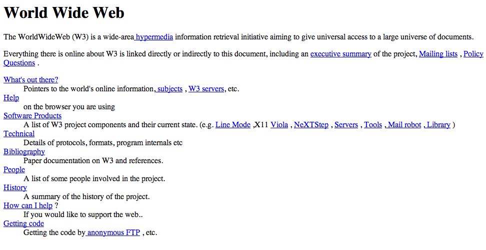
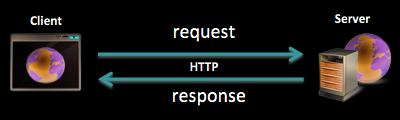
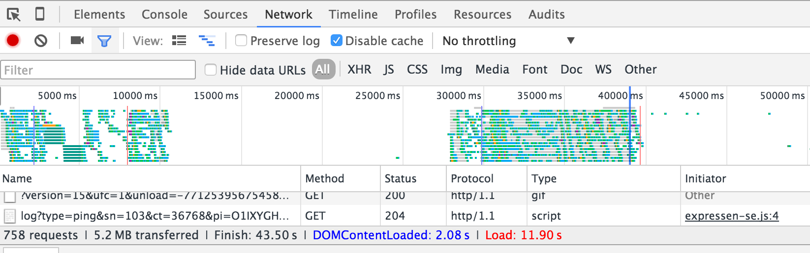
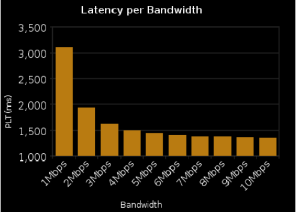

<!-- Start -->
# Today's lecture <!-- {_style="font-size:140%"} -->
* HTTP
  * History
  * How does it work?
* Web Servers
  * What?
  * How?
  * Different kinds?

Note:
These are the topics for todays lecture.

--
# Interact with students
* How to get feedback from distance students?
* How to ask questions?
* Did the student understand the lecture?

 [http://pingo.upb.de/350775](http://pingo.upb.de/350775)

<!-- {_class="pingo-qr" style="top:220px"} -->

--
<!-- {_data-transition="fade-in fade-out"} -->
## Which protocols are involved when you try to get a web page?
<!-- {_style="font-size:140%"} -->
1. DNS
2. SMTP
3. UDP
4. HTTP/HTTPS
5. TCP
6. IP

<!-- {_class="pingo-sc" style="font-size:100%"} -->

 [http://pingo.upb.de/350775](http://pingo.upb.de/350775)

<!-- {_class="pingo-qr" style="top:0px"} -->

--
<!-- {_data-transition="fade-in fade-out"} -->
## Which protocols are involved when you try to get a web page?
<!-- {_style="font-size:140%"} -->

<!-- {_class="pingo-chart"} -->

{Paste Handler}
<!-- {_class="chart-input" contenteditable="true" onpaste="handlepaste(this, event)"} -->

--
### What happens when we try to visit a website
www.google.com

---
<!-- {_data-transition="fade-in fade-out"} -->
## In what language does a Web server communicate?

1. English
2. Internet Protocol
3. Hypertext Transfer Protocol
4. Binary

<!-- {_class="pingo-sc" style="font-size:100%"} -->

 [http://pingo.upb.de/350775](http://pingo.upb.de/350775)

<!-- {_class="pingo-qr" style="top:0px"} -->

--
<!-- {_data-transition="fade-in fade-out"} -->
## In what language does a Web server communicate?

<!-- {_class="pingo-chart"} -->

{Paste Handler}
<!-- {_class="chart-input" contenteditable="true" onpaste="handlepaste(this, event)"} -->

--
## It all started here

<!-- {_style="width:700px"} -->

CC Image: https://www.flickr.com/photos/arselectronica

Note:
European Organization for Nuclear Research
CERN's main function is to provide the particle accelerators and other infrastructure needed for high-energy physics research

--
## Tim Berners-Lee

<!-- {_style="width:60%"} -->

[CC BY-SA 4.0](http://creativecommons.org/licenses/by-sa/4.0) Paul Clarke

--
## First Web Server
* Sharing and updating information among researchers
* CERN was, 1989, the largest Internet node in Europe
* Berners-Lee saw an opportunity to join hypertext with the Internet:

<!-- {_style="width:65%;""} -->
> "I just had to take the hypertext idea and connect it to the Transmission Control Protocol and domain name system ideas and—ta-da!—the World Wide Web"

<!-- {_style="width:60%; margin: 0px; font-size: 80%"} -->

--
## Internet protocol suite
The web is an application running on the Internet  
HTTP is an application protocol running on the TCP/IP stack

<!-- {_style="width:60%"} -->

--
## High tech web apps at this time...

<!-- {_style="width:60%"} -->

--
## Request - Response
* Client / server architecture
* Request / Response
* Stateless, no session
* No built-in security

<!-- {_style="width:60%"} -->

--
## HTTP versions
* HTTP 0.9 (1991)
* HTTP 1.0 (1996)
* HTTP 1.1 (1997)
* HTTP 2 (May 2015)

<!-- {_style="font-size:100%"} -->

--
### HTTP Methods (verbs)
*From Client to Server*

| *Verbs*        | *Actions*           |
| ------------- |-------------|
|GET | Get data; search result |
|POST | Create data |
|PUT | Update data |
|PATCH | Partial update of resource |
|DELETE | Delete a resource |
|HEAD | Just get headers |
|OPTIONS | Check what the server can do |
| | |

<!-- {_style="margin:0px"} -->

--
## Status codes - Server to client
* 1xx - Informational
 * 101 Switching Protocols
* 2xx - Successful
 * 200 OK, 201 Created, 204 No Content
* 3xx - Redirection
 * 302 Found (follow "Location"), 304 Not Modified
* 4xx - Client Error
 * 400 Bad request, 401 Unauthorized
* 5xx - Server Error
 * 500 Internal Server Error

--
## HTTP is old but it works great!!?

--
## Requests and TCP connections

* Keep-Alive, Pipeline (HTTP 1.1)

--
## So why do we need HTTP/2?
* More bandwidth will speed things up!
* Latency!

--
### HTTP/2
* Based on SPDY (Google)
* Internet Engineering Task Force (IETF)
* Supported by most browsers and servers
* May 14, 2015, Proposed standard [RFC 7540](https://tools.ietf.org/html/rfc7540)

Note:
The Internet Engineering Task Force (IETF) develops and promotes voluntary Internet standards, in particular the standards that comprise the Internet protocol suite (TCP/IP).

--
### So whats new in HTTP/2?
* Multiplexing - one single TCP connection for many request
* Server push (not as in Web Sockets)
* Data Compression of HTTP Headers
* Binary data streams
* Priority flags

Ilya Grigorik - https://www.youtube.com/watch?v=yURLTwZ3ehk

---
## Web Servers

* Server software that understands HTTP/HTTPS
* Serve static web resources
  * Reading from file system
  * Documents, static files, streaming media
* Serve dynamic web resources
  * Support server-script languages like PHP, C# (ASP.NET)...
  * Render web data on-the-fly (HTML, JSON...)
  * Communicate with databases
  * Send request to other servers

--
## Web Servers - Terminology
* Reverse proxy
* CGI
* Load balancer
* SSL
* LAMP
* Application server
* Static/Dynamic content
* URL
* .htaccess
* Virtual hosting (multiple domain names)

--
## Web Servers
Reverse proxy
* Hide the origin server or servers
* Firewalls can protect against common web-based attacks, such as DOS or DDOS
* Distribute the load from incoming requests to several servers
* Reduce load on its origin servers by caching content

<!-- {_style="width:70%"} -->

--
## Web Servers
Common Gateway Interface (CGI)
* a standard way for web servers to interface with executable programs installed on a server that generate web pages dynamically.
* FastCGI
  * reduce the overhead associated with interfacing the web server and CGI programs, allowing a server to handle more web page requests at once.

<!-- {_style="width:60%"} -->

--
## Web Servers
Virtual hosting
* Multiple web sites on one server
  * Name-based
  * IP-based
  * Port-based

--
<!-- {_data-transition="fade-in fade-out"} -->
## Have you installed a web server?

1. No
2. Apache
3. Nginx
4. IIS
5. Other

<!-- {_class="pingo-sc" style="font-size:100%"} -->

 [http://pingo.upb.de/350775](http://pingo.upb.de/350775)

<!-- {_class="pingo-qr" style="top:0px"} -->

--
<!-- {_data-transition="fade-in fade-out"} -->
## Have you installed a web server?

<!-- {_class="pingo-chart"} -->

{Paste Handler}
<!-- {_class="chart-input" contenteditable="true" onpaste="handlepaste(this, event)"} -->

--
## Web Servers

* Apache
  * The A in LAMP
* IIS for Windows server (Internet Information Services)
  * .NET
* Nginx
  * Often also used as load balancer and reverse proxy (in front of web application)
* Apache Tomcat
  * JAVA, Different components for servlet, HTTP, JSP engine
* Node.js
  * A platform! Create a web server with http module!

<!-- {_style="width:60%"} -->

--
## About Apache
* The most used web server on the Internet
  * http://w3techs.com/technologies/overview/web_server/all
* Open-source HTTP server for both UNIX and Windows
  * [Apache Software Foundation](Apache Software Foundation)
* The Apache HTTP Server ("httpd") was launched in 1995
* Every request is spawn to a own thread (like a own process)
  * Thread pool
* Loadable Dynamic Modules

--
## Apache - General Structure
* htdocs
* conf
* logs
* cgi-bin

--
## About Nginx ("engine x")
* Free web server, 2002, Igor Sysoev, second most used
  * http://w3techs.com/technologies/overview/web_server/all
  * Also used as (reversed) proxy, load balancer, ...
* Nginx uses an asynchronous event-driven approach to handling requests
  * Non-blocking mode in a single main thread
  * Event-loop receiving event from a queue (like javascript event-loop)
  * Can handle more request, handle high loads
  * Don´t perform well on time consuming operations that blocks the tread
* [Event loop](https://assets.wp.nginx.com/wp-content/uploads/2015/06/NGINX-Event-Loop2-e1434744201287.png)

<!-- {_style="width:60%"} -->

--
## About IIS
* Microsoft, tight coupled to Windows
* Using modules and extensions
* Graphic Administration (tight connection to the operating system)
* Powershell
* .NET applications

--
## How to choose?
* IIS
  * ASP.NET
* Apache
  * PHP, Pearl, Python
* Nginx
  * Reverse Proxy
  * Static content
  * Load balancer

--
## Good Reading
* [Apache HTTP Server Documentation](http://httpd.apache.org/docs/)
* [Nginx - Beginner’s Guide](http://nginx.org/en/docs/beginners_guide.html)
* [Apache vs Nginx: Practical Considerations](https://www.digitalocean.com/community/tutorials/apache-vs-nginx-practical-considerations)
* [How to Configure Nginx](https://www.linode.com/docs/websites/nginx/how-to-configure-nginx)
* [Apache 2 Basic Configuration](http://code.tutsplus.com/articles/apache-2-basic-configuration-on-unix-like-systems--net-26607)
