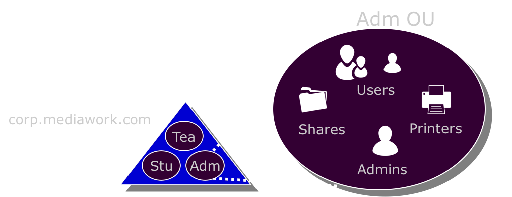

<!-- Start -->
# Today's lecture <!-- {_style="font-size:140%"} -->
* Directory Services
* Active Directory
  * Overview
  * Database
  * Logical and Physical structure
  * Installation
  * Centralized user management
    * OU
    * Profile
    * Groups
  * Additional Domain Controllers
  * FSMO

Note:
These are the topics for todays lecture.


---
# Directory Service
* Central database for storing network resources
  * Each resource on the network is considered an object
  * Information is stored as attributes of that object
  * Information within objects can be made secure
* A directory service defines the namespace for the network
  * Rules that determine how network resources are named
  * The rules specify that the names be unique and unambiguous
  * Distinguished name (DN)

<!-- {_style="font-size:90%; width:65%"} -->

 <br />
[CC Image - Adam Lehman](https://www.flickr.com/photos/14519665@N05/)

<!-- {_style="position: absolute; top: 10px; left:1100px; font-size:30%"} -->


--
## Directory Service
* Shared information infrastructure
  * Locating
  * Managing
  * Administering
  * Organizing
  * Network Resources
    * folders
    * files
    * printers
    * users
    * groups
    * devices
    * telephone numbers


--
## Directory Service
Lightweight Directory Access Protocol (LDAP)
* open, vendor-neutral, industry standard protocol
* Accessing and maintaining distributed directory services
* Internet Protocol (IP)
* A simpler subset of the standard X.500
* The client may request the following operations:
  * Search
  * Add a new entry
  * Delete an entry
  * Modify an entry
  * Modify Distinguished Name (DN) — move or rename an entry

<!-- {_style="width:65%"} -->


--
## Directory Service
Distinguished Name
* `cn` - Common Name
* `ou` - Organizational Unit
* `dc` - Domain Component
* Examples

```ldap
cn=John Doe,dc=example,dc=com
cn=John Doe,ou=department,dc=example,dc=com
```


--
## Directory Service
LDAP implementations
* Active Directory
* Apache Directory Server
* eDirectory
* Red Hat Directory Server
* OpenLDAP


---
## Active Directory
* Active Directory Services
  * Domain Services
  * Lightweight Directory Services
  * Certificate Services
  * Federation Services
  * Rights Management Services


--
## Active Directory - Domain Services


--
## Active Directory - Domain Services
Active Directory database consists of three partitions
* Scheme partition
  * Classes
  * Attribute
* Configuration partition
  * Forest-wide configuration
  * Sites
  * Exchange global settings
  * Mailbox policies
* Domain partition
  * All domain-specific objects
  * Information about
    * Computers
    * User
    * Groups

<!-- {_style="font-size:70%"} -->


<!-- {_style="position: absolute; top: 500px; left:600px; width: 200px"} -->


--
## Active Directory - Domain Services
* Logical structure
  * Domains
  * Organizational units
  * Tree
  * Forest
* Physical structure
  * Sites
  * Domain controllers


--
## Active Directory - Domain Services
Active Directory reflects the logical structure of your organization:
* allows you to search by item name
* the structure becomes transparent to users


<!-- {_style="width: 800px"} -->


--
## Active Directory - Logical Structure
### Organizational Units (OU)
* is a container for organizing items within a domain
* all domains can maintain its own OU hierarchy
* organizational unit is the smallest container that you can delegate administrative rights

<!-- {_style="width:65%"} -->


<!-- {_style="width: 800px"} -->


--
## Active Directory - Logical Structure
### What should I use OU for?
1. Organizing
2. Delegation of administration
3. Group Policies

<!-- {_style="font-size:85%"} -->


<!-- {_style="position: absolute; top: 350px; left:0px"} -->

Note:
How should you build the OU structure?
  In view of point 2 & 3


--
## Active Directory - Logical Structure
### Domain
* A domain is a security area
* Active Directory can consist of one or more domains
* A domain can span more than one physical area
* A domain can span one or more sites

<!-- {_style="width:65%"} -->


--
## Active Directory - Logical Structure
### Tree
* A hierarchical arrangement of one or more domains
* Shared namespace
* Shares schedule
* Shares global catalog
* Scalable

<!-- {_style="width:65%"} -->


<!-- {_style="position: absolute; top: 400px; left:100px; width: 600px"} -->


--
## Active Directory - Logical Structure
Forest
* A grouping or hierarchical arrangement of one or more separate, completely independent domain trees
* Shares schedule
* Each tree has its own namespace
* Shares global catalog
* Work independent of each other

<!-- {_style="width:65%"} -->


<!-- {_style="width: 600px"} -->


--
## Active Directory - Physical structure
The physical components of Active Directory:
* Sites
* Domain controllers

The physical structure is used to:
* Configure and manage network traffic
* Optimize replication traffic and logon processes


--
## Active Directory - Physical structure
### Sites
* One or more IP subnets
* Usually the same limits as a LAN
* Sites is not part of the namespace
* Active Directory allows multiple domains within a site and several sites in a domain
* You create sites for two primary reasons:
* Optimize replication traffic
* Login via reliable and fast connections

<!-- {_style="width:65%"} -->


--
## Active Directory - Physical structure
### Domain Controllers
* Complete copy of the database
* Replicates automatically
* Replicates immediately
* Multi-Master Replication
* Manages all aspects of user-domain interactions

<!-- {_style="width:65%"} -->


--
## Active Directory - Physical structure
### Global catalog server
* Central repository
* First domain controller in the forest
* Save a copy of all the object's attributes in the directory for its host domain. And a partial copy of every other object's attributes found in woods
* objects replicated to the global catalog server

The global catalog server performs two key roles:
* provides network logon
* provides directory information regardless of which domain in the forest that the information is

<!-- {_style="width:65%"} -->


--
## Active Directory - Physical structure
### Global catalog server
* What is the purpose of the Global Catalog
* Optimization, contains parts of the AD database
* A GC contains several domains AD-content
  * All objects, not all attributes
  * Table of content for directory
* Required for users to be able to log in
* Membership of universal groups


<!-- {_style="width:65%"} -->


--
## Active Directory - Installation
* Verify the NetBIOS name
* Verify TCP/IP settings
* NTFS, as well as hard drive space
* Planning of the logical structure
* Planning of the physical structure
* Verify existing DNS servers
* Add Role “Active Directory Domain Services”
* Run Post-Setup Wizard to Promote to DC
* Verify DNS service

<!-- {_style="width:65%"} -->
