<!-- Start -->
# Today's lecture <!-- {_style="font-size:140%"} -->
* Cryptography - Basic Principles <!-- {_class="fragment"} -->
  * No just encryption
  * Asymmetric and Symmetric keys
  * Certificate
  * SSH
* Permissions <!-- {_class="fragment"} -->
  * File Permissions in Linux
  * File Permissions in Windows
  * A G DL P
* Network <!-- {_class="fragment"} -->
  * Firewall
  * DMZ


Note:
These are the topics for todays lecture.


---
## Cryptography - Basic Principles <!-- {_style="font-size:180%;""} -->
* Confidentiality (Encryption) <!-- {_class="fragment"} -->
* Authentication <!-- {_class="fragment"} -->
* Integrity <!-- {_class="fragment"} -->
* Non Repudiation <!-- {_class="fragment"} -->

<!-- {_style="font-size:150%;"} -->

Note:
Encryption
In a simplest form, encryption is to convert the data in some unreadable form. This helps in protecting the privacy while sending the data from sender to receiver.
Authentication
Suppose, Alice sends a message to Bob and now Bob wants proof that the message has been indeed sent by Alice. This can be made possible if Alice performs some action on message that Bob knows only Alice can do.
Integrity
Now, one problem that a communication system can face is the loss of integrity of messages being sent from sender to receiver. Bob wants to know that the message Alice sent hasn't been modified on the way. This can be achieved by using the concept of cryptographic hash.
Non Repudiation
What happens if Alice sends a message to Bob but denies that she has actually sent the message? Cases like these may happen and cryptography should prevent the originator or sender to act this way. One popular way to achieve this is through the use of digital signatures.


--
## Cryptography - Basic Principles <!-- {_style="font-size:180%;"} -->
### Secret Key Cryptography
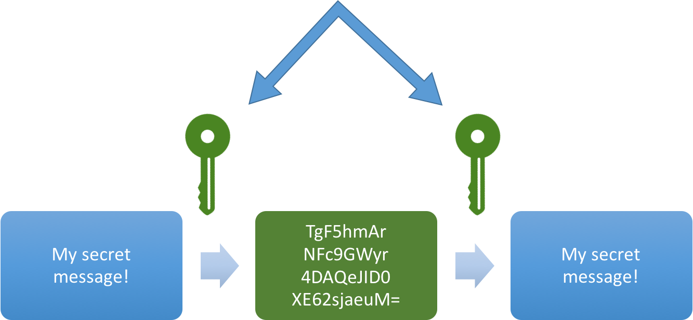<!-- {_style="width:550px;"} -->
* The sender applies a key to encrypt a message <!-- {_class="fragment"} -->
* The receiver applies the same key to decrypt the message <!-- {_class="fragment"} -->
* Only single key is used - symmetric encryption <!-- {_class="fragment"} -->
* The biggest problem with symmetric encryption is distribution of the key <!-- {_class="fragment"} -->


--
## Cryptography - Basic Principles <!-- {_style="font-size:180%;"} -->
### Public Key Cryptography
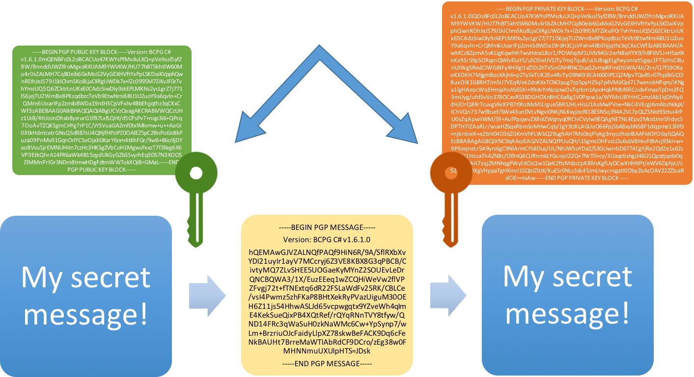<!-- {_style="width:600px;"} -->

* Each party has a private key and a public key <!-- {_class="fragment"} -->
* The private is secret and is not revealed while the public key is shared with all those whom you want to communicate with <!-- {_class="fragment"} -->

<!-- {_style="width:70%;"} -->


--
## Cryptography - Basic Principles <!-- {_style="font-size:180%;""} -->
### Hash Functions
* Does not involve any key <!-- {_class="fragment"} -->
* Uses a fixed length hash value that is computed on the basis of the message <!-- {_class="fragment"} -->
* Used to check the integrity of the message to ensure that the message has not be altered,compromised or affected by virus <!-- {_class="fragment"} -->

<!-- {_style="margin-right:25%"} -->
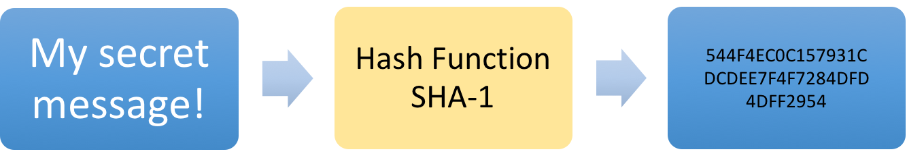<!-- {_style="width:800px;"} -->


--
## Certificates
* Digitally signed documents
* Verifies the validity of the public key <!-- {_class="fragment"} -->
* The user's guarantee that: <!-- {_class="fragment"} -->
  * the public key really belongs to the sender
  * the transmitter holds the private key
* What can be done with the public key <!-- {_class="fragment"} -->


--
## Certificates
* What does a certificate contain?
  * Serial Number
  * Subject
  * Signature Algorithm
  * Signature
  * Issuer
  * Validity period
  * Key-Usage
  * Public Key
  * Thumbprint Algorithm
  * Thumbprint (also known as fingerprint)

Note:
Serial Number: Used to uniquely identify the certificate.
Subject: The person, or entity identified.
Signature Algorithm: The algorithm used to create the signature.
Signature: The actual signature to verify that it came from the issuer.
Issuer: The entity that verified the information and issued the certificate.
Valid-From: The date the certificate is first valid from.
Valid-To: The expiration date.
Key-Usage: Purpose of the public key (e.g. encipherment, signature, certificate signing...).
Public Key: The public key.
Thumbprint Algorithm: The algorithm used to hash the public key certificate.
Thumbprint (also known as fingerprint): The hash itself, used as an abbreviated form of the public key certificate.


--
## Certificates
### Public-Key Infrastructure (PKI)
* Anyone can send Bob a secret message <!-- {_class="fragment"} -->
  * Provided they know Bob’s public key
* How do we know a key belongs to Bob? <!-- {_class="fragment"} -->
  * If imposter substitutes another key, read Bob’s mail
* One solution: PKI <!-- {_class="fragment"} -->
  * Trusted root authority (VeriSign, GlobalSign)
    * Everyone must know the verification key of root authority
  * Root authority can sign certificates
  * Certificates identify others, including other authorities
  * Leads to certificate chains


[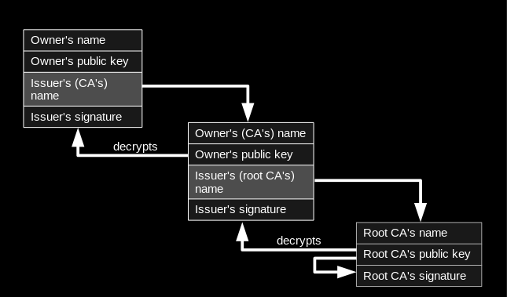 <br />By Yanpas (Own work) [CC BY-SA 4.0](http://creativecommons.org/licenses/by-sa/4.0)](https://commons.wikimedia.org/wiki/File%3AChain_of_trust.svg)

<!-- {_style="position:fixed;right: 0px; bottom: 0px;font-size:40%; width:600px"} --> <!-- {_class="fragment"} -->


--
## Certificate
[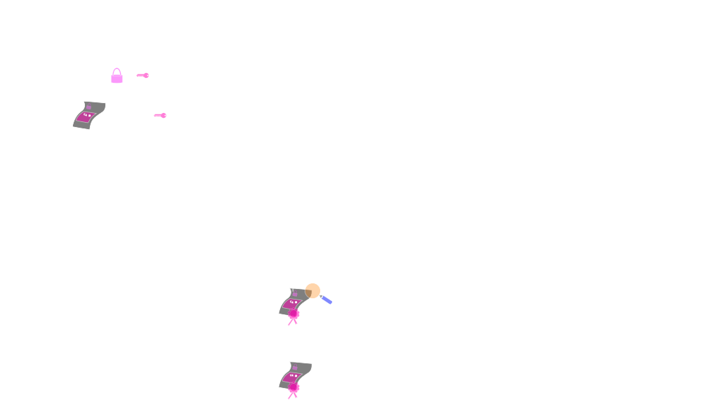 <br />Eus Kevin at English Wikipedia [CC BY-SA 3.0](http://creativecommons.org/licenses/by-sa/3.0)](https://upload.wikimedia.org/wikipedia/commons/9/96/Usage-of-Digital-Certificate.svg)

<!-- {_style="font-size:40%"} -->


--
## Certificate
[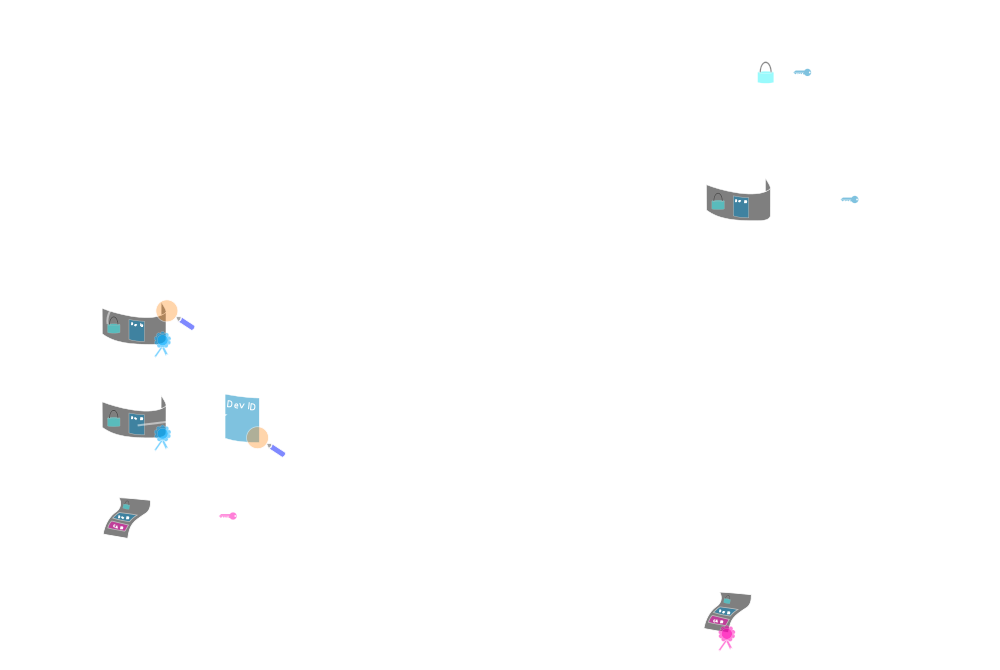 <br />Eus Kevin at English Wikipedia [CC BY-SA 3.0](http://creativecommons.org/licenses/by-sa/3.0)](https://upload.wikimedia.org/wikipedia/commons/9/96/Usage-of-Digital-Certificate.svg)

<!-- {_style="font-size:40%"} -->


--
## Certificate
[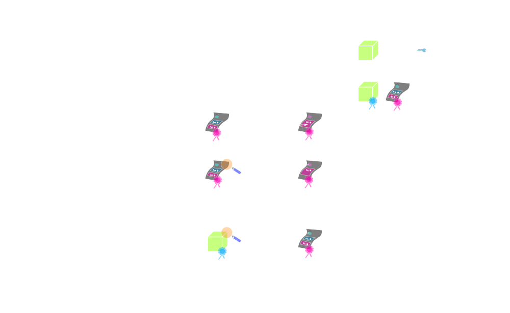 <br />Eus Kevin at English Wikipedia [CC BY-SA 3.0](http://creativecommons.org/licenses/by-sa/3.0)](https://upload.wikimedia.org/wikipedia/commons/9/96/Usage-of-Digital-Certificate.svg)

<!-- {_style="font-size:40%"} -->


--
## Certificates - Web Servers
1. Client connect on port 443, requests the server identity <!-- {_class="fragment"} -->
2. Server sends a copy of the TLS Certificate, including servers public key <!-- {_class="fragment"} -->
3. Client check against list of thrusted CA´s and that the certificate is valid. Creates a symmetric key, encrypt it with the public key from the server. <!-- {_class="fragment"} -->
4. Server decrypt the symmetric key with its own private key. Start using the symmetric key when encrypt the messages <!-- {_class="fragment"} -->
5. We have a trusted and encrypted communication <!-- {_class="fragment"} -->

<!-- {_style="font-size:70%; margin-right:25%"} -->
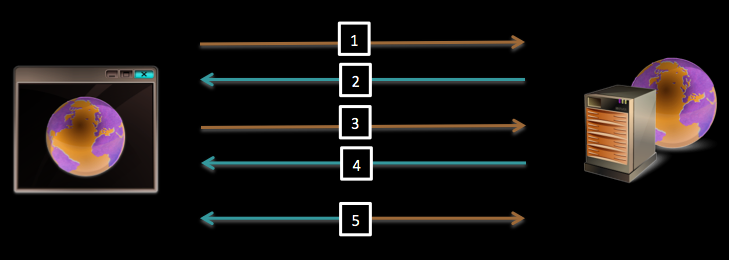


--
## Perform SSH Login Without Password
1. Create public and private keys using ssh-key-gen on localhost <!-- {_class="fragment"} -->
  ```
  ssh-keygen
  Generating public/private rsa key pair.
  Enter file in which to save the key (/home/ubuntu/.ssh/id_rsa):
  Enter passphrase (empty for no passphrase):
  Enter same passphrase again:
  Your identification has been saved in /home/ubuntu/.ssh/id_rsa.
  Your public key has been saved in /home/ubuntu/.ssh/id_rsa.pub.
  ```
2. Copy the public key to remote-host using ssh-copy-id <!-- {_class="fragment"} -->
  ```
  ssh-copy-id -i ~/.ssh/id_rsa.pub user@remot-ip
  ```
3. Login to remote-host without entering the password <!-- {_class="fragment"} -->
  ```
  ssh user@remot-ip
  or
  ssh -i ~/.ssh/id_rsa.pub user@remot-ip
  ```


---
## Linux File Permissions
* Permission Groups
  * owner
    * The Owner permissions apply only the owner of the file or director
  * group
    * The Group permissions apply only to the group that has been assigned to the file or directory
  * all users
    * The All Users permissions apply to all other users on the system
* Permission Types <!-- {_class="fragment"} -->
  * read
    * The Read permission refers to a user's capability to read the contents of the file.
  * write
    * The Write permissions refer to a user's capability to write or modify a file or directory.
  * execute
    * The Execute permission affects a user's capability to execute a file or view the contents of a directory.

<!-- {_style="margin-right:25%"} -->


--
## Linux File Permissions
```
user@servername:~$ ls -l
drwxr-xr-x  8 jacob  staff  272 Apr 27 15:49 Admin
-rw-r--r--  1 jacob  staff  162 Apr 27 12:55 README.md
drwxr-xr-x  3 jacob  staff  102 Apr 27 13:17 Students
drwxr-xr-x  4 jacob  staff  136 Apr 28 10:15 libs
-rw-r--r--  1 jacob  staff   49 Apr 28 13:33 newUsers.csv
-rw-r--r--  1 jacob  staff  176 Apr 28 13:33 newUsers.html
```
<!-- {_style="margin: 0px; width:65%"} -->

* r = Read, w = Write, x = Execute <!-- {_class="fragment"} -->
* The first character is the special permission flag that can vary <!-- {_class="fragment"} -->
* The following set of three characters (rwx) is for the owner permissions <!-- {_class="fragment"} -->
* The second set of three characters (rwx) is for the Group permissions <!-- {_class="fragment"} -->
* The third set of three characters (rwx) is for the All Users permissions <!-- {_class="fragment"} -->


--
## Linux File Permissions
### Changing permissions and owner
* `chmod permission filename`
  * r = 4
  * w = 2
  * x = 1
  * -R for recursive
* `chown owner:group filename` <!-- {_class="fragment"} -->

```
user@servername:~$ chmod 600 README.md
user@servername:~$ chown calle:student README.md
user@servername:~$ ls -l
drwxr-xr-x  8 jacob  staff   272 Apr 27 15:49 Admin
-rw-------  1 calle  student 162 Apr 27 12:55 README.md
drwxr-xr-x  3 jacob  staff   102 Apr 27 13:17 Students
drwxr-xr-x  4 jacob  staff   136 Apr 28 10:15 libs
-rw-r--r--  1 jacob  staff    49 Apr 28 13:33 newUsers.csv
```
<!-- {_style="margin: 0px; width:65%"} -->


--
## Windows Permissions
* Directory permissions:
  * Read
  * Write
  * List Folder Contents
  * Read & Execute
  * Modify
  * Full Control
* File permissions: <!-- {_class="fragment"} -->
  * Read
  * Write
  * Read & Execute
  * Modify
  * Full Control


--
## Windows Permissions
### Directory permissions
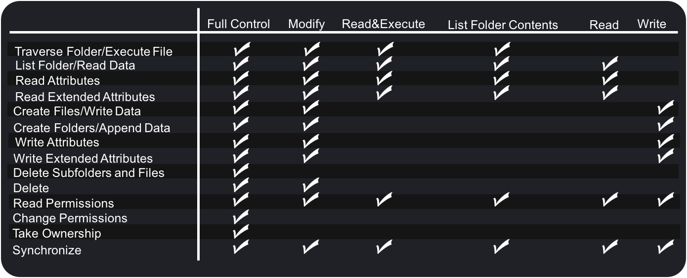


--
## Windows Permissions
### File permissions
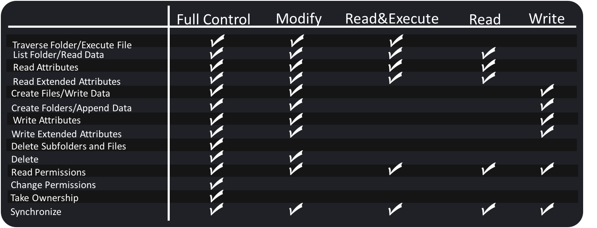


--
## Windows Permissions
* Inheritance
  * NTFS permissions are inherited by default down to the underlying directories and files
  * You can block inheritance
* Blocking of inheritance <!-- {_class="fragment"} -->
  * Copy
    * Allows you to copy the existing permissions from the parent folder, but allows no future changes
  * Remove
    * Allows you to delete the permissions inherited from the parent folder
    * You can explicitly set the permissions you want the file or subdirectory

<!-- {_style="width:65%"} -->


--
## Windows Permissions
* Access Control List (ACL):
  * An ACL is saved for each file and directory on an NTFS volume <!-- {_class="fragment"} -->
  * Contains a list of all user accounts, groups, and computers that have access to the file or directory <!-- {_class="fragment"} -->
  * Describes the type of access that user accounts, groups, and computers <!-- {_class="fragment"} -->
  * The ACL must contain an Access Control Entry (ACE) for the user account, group, or computer that the user belongs to access the file or directory <!-- {_class="fragment"} -->
  * User accounts that are not on the ACL list is implicitly denied access to the file or directory <!-- {_class="fragment"} -->
  * Users who are denied access in the ACL list is explicitly denied access to the file or directory <!-- {_class="fragment"} -->

<!-- {_style="width:65%"} -->


--
## Windows Permissions
### Access Control List
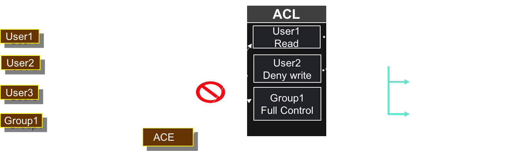


--
## Windows Permissions
What happens with the permissions when you move or copy files and directories?

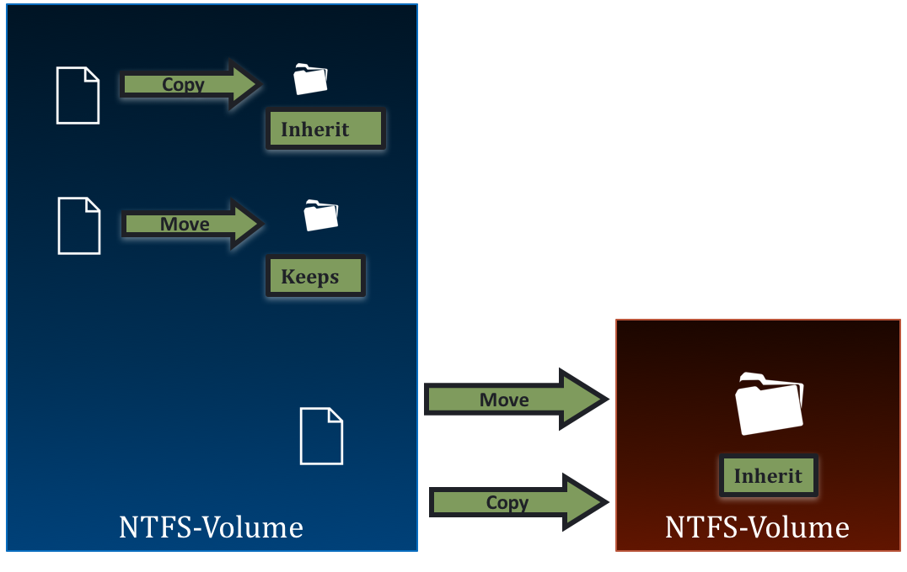
<!-- {_style="width:800px"} -->


--
## Windows Permissions
### Changing Permissions

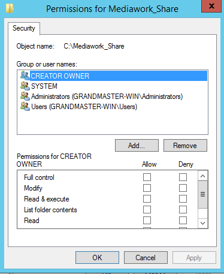


--
## Windows Permissions
### Changing Permissions

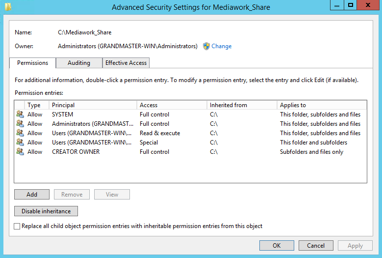


--
## Windows Permissions
### Changing Permissions

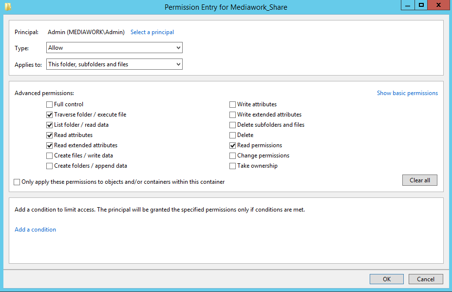
<!-- {_style="width:800px"} -->


--
## Windows Share
* Shared directories
  * you can make resources available to others by sharing <!-- {_class="fragment"} -->
  * on FAT partitions, you can only set permissions on the shared directory <!-- {_class="fragment"} -->
  * on NTFS volumes, you can set permissions on both the distributed directory and the files in the directory <!-- {_class="fragment"} -->

<!-- {_style="width:65%"} -->

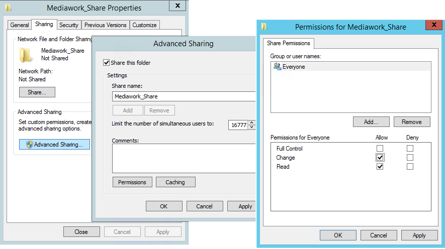
<!-- {_style="width:600px"} --> <!-- {_class="fragment"} -->


--
## Windows Share
### Share permissions
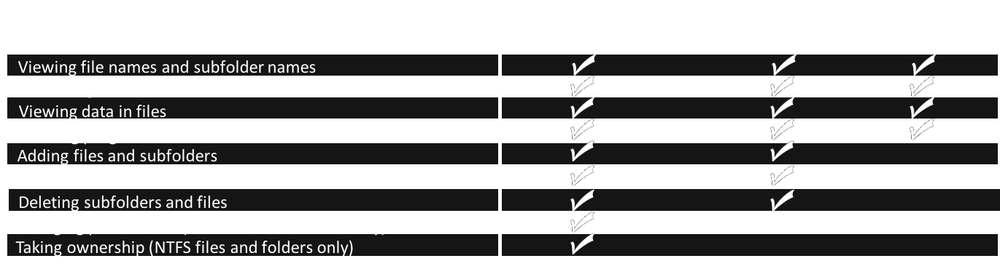


--
## Role-based Access Control
* Do not assign permissions directly to individual user accounts <!-- {_class="fragment"} -->
* Individuals acquire access through their roles within an organization <!-- {_class="fragment"} -->

<br />
### Active Directory AGDLP <!-- {_class="fragment"} -->
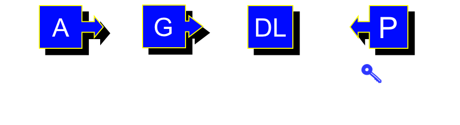 <!-- {_class="fragment"} -->


---
## Firewall
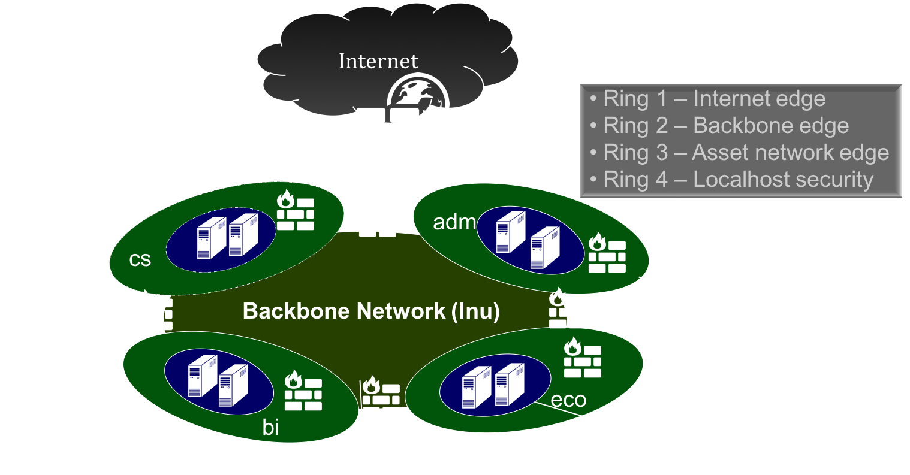
<!-- {_style="width:900px"} -->


--
## Firewall
### Ring 1 - Internet Edge
* The first attack point
* Being exposed to attacks from outside <!-- {_class="fragment"} -->
* Common mistakes <!-- {_class="fragment"} -->
  * Many places the most intelligent and powerful firewall
  * Most attacks occur from inside the network
* Speed is crucial <!-- {_class="fragment"} -->
  * Usually a high performance hardware firewall


--
## Firewall
### Ring 2 - Backbone Edge
* Between the internal network and the Internet Edge
* Backbone networks are providing a common network that all network segments are connected to <!-- {_class="fragment"} -->
* Total volume of traffic flowing in and out through the backbone Firewall is smaller than that of the Internet edge firewall <!-- {_class="fragment"} -->
* Begins the real firewall work through dynamic application layer filtering of both inbound and outbound traffic <!-- {_class="fragment"} -->

<!-- {_style="width:65%"} -->


--
## Firewall
### Ring 3 - Asset network edge
* Packet filtering is insufficient
* Not only examine all incoming traffic with profound dynamic packet filtering, but also examine the output of user/group control <!-- {_class="fragment"} -->
* User/group control is an absolute requirement: <!-- {_class="fragment"} -->
  * You must be able to log the user name for all outgoing
  * You must be able to log an application
  * Your organization may be held responsible for material that leaves the network

<!-- {_style="width:65%"} -->


--
## Firewall - Ring 4 - LocalHost security
* Computer-based security is the last defense.
* No firewall can completely offset the weaknesses that exist on your computer <!-- {_class="fragment"} -->
* The only thing that can prevent attacks from the local network <!-- {_class="fragment"} -->
* Check the inbound/outbound connections that can be made and which applications can send and receive data <!-- {_class="fragment"} -->
* Antivirus should be used to block viruses from other networks <!-- {_class="fragment"} -->
* Operating systems and applications must be kept updated <!-- {_class="fragment"} -->
* Anti-Spyware, -Spam, -adware <!-- {_class="fragment"} -->
* Users and services should be run with minimal permissions <!-- {_class="fragment"} -->

<!-- {_style="width:70%"} -->


--
## Firewall
### Smaller networks
* Simple networks does not need all rings
* Public services should be located in the DMZ segment between the Internet edge and  Asset edge <!-- {_class="fragment"} -->
* The simplest networks only need to place a single firewall at the Internet edge <!-- {_class="fragment"} -->
  * Do not forget about Localhost security

<!-- {_style="width:70%"} -->


--
## Demilitarized Zone (DMZ)
* A network that is placed as a neutral zone between a corporate network and the Internet
* Prevents outside users from getting direct access to the internal corporate network <!-- {_class="fragment"} -->
* Includes the company's external/public resources: <!-- {_class="fragment"} -->
  * Web servers
  * Public Name servers
  * E-mail
  * FTP
* If a DMZ is penetrated the attacker won't get access to information on the internal network <!-- {_class="fragment"} -->

<!-- {_style="width:70%"} -->
